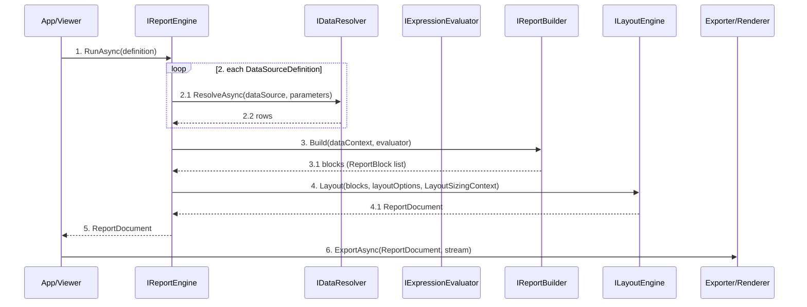

# 02 - Report Generation Flow

This document explains exactly how one report is generated.

Deep-dive companion docs:
- [14 - RunAsync Execution Call Graph](./14-runasync-execution-call-graph.md)
- [15 - Expression Runtime Flow](./15-expression-runtime-flow.md)
- [16 - Exporter Execution Flow](./16-exporter-execution-flow.md)

## High-Level Flow

For advanced scenarios, use the overload that accepts runtime parameters,
`ILayoutSizingContext`, and optional `LayoutOptions`.

## Detailed Stages

## 1. Data Resolution

### 1.1 Iterate configured data sources

- `IReportEngine` loops through `ReportDefinition.DataSources`.

### 1.2 Resolve each source

- For each source, `IDataResolver.ResolveAsync(...)` is called.

### 1.3 Build runtime data context

- Returned rows are stored into `DataContext` keyed by data-source ID.

## 2. Report Blocks Build

### 2.1 Build ordered blocks

- `IReportBuilder.Build(dataContext, evaluator)` transforms data into ordered report blocks.

### 2.2 Shape expression-aware content

- This is where row iteration and expression-aware content shaping happen.

See also: [ReportBlock vs PageSectionBlock (Semantic Distinction)](./04-api-core-and-definition.md#reportblock-vs-pagesectionblock-semantic-distinction).

## 3. Layout

`ILayoutEngine` runs LayoutSizing → Arrange → Pagination.

### 3.1 LayoutSizing pass

- Each element computes desired size.

### 3.2 Arrange pass

- Each element gets final bounds.

### 3.3 Pagination pass

- Content is split into `PageBlock`s.

Result is an immutable `ReportDocument`.

## 4. Render/Export

### 4.1 Consume immutable layout output

- Renderers/exporters receive only `ReportDocument`.

### 4.2 Preserve layout ownership

- They must not perform layout decisions.

## Where Bugs Usually Happen

1. Data resolver returns no rows.
2. Report Builder returns empty blocks.
3. Unit mismatch in HTML/CSS sizing.
4. Incorrect coordinate model for nested elements.

See [11 - Troubleshooting](./11-troubleshooting-and-debugging.md).
