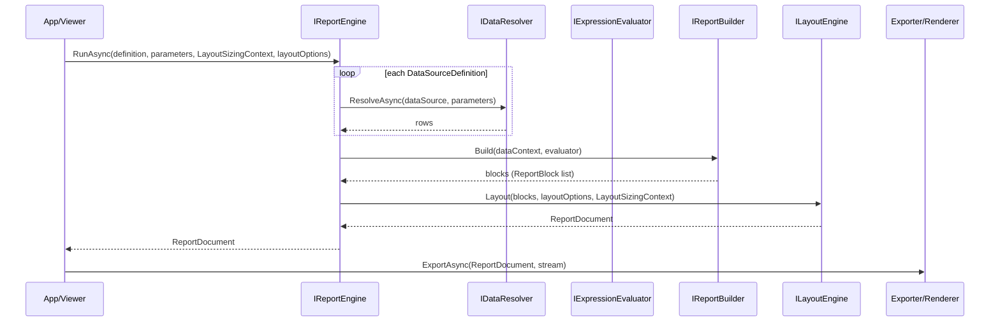

# 02 - Report Generation Flow

This document explains exactly how one report is generated.

## High-Level Flow

## Detailed Stages

## 1) Data Resolution

- `IReportEngine` loops through `ReportDefinition.DataSources`.
- For each source, `IDataResolver.ResolveAsync(...)` is called.
- Returned rows are stored into `DataContext` keyed by data-source ID.

## 2) Report Blocks Build

- `IReportBuilder.Build(dataContext, evaluator)` transforms data into ordered report blocks.
- This is where row iteration and expression-aware content shaping happen.

## 3) Layout

`ILayoutEngine` runs LayoutSizing → Arrange → Pagination.

- **LayoutSizing pass:** each element computes desired size
- **Arrange:** each element gets final bounds
- **Pagination:** content is split into `PageBlock`s

Result is an immutable `ReportDocument`.

## 4) Render/Export

- Renderers/exporters receive only `ReportDocument`.
- They must not perform layout decisions.

## Where Bugs Usually Happen

1. Data resolver returns no rows.
2. Report Builder returns empty blocks.
3. Unit mismatch in HTML/CSS sizing.
4. Incorrect coordinate model for nested elements.

See [11 - Troubleshooting](./11-troubleshooting-and-debugging.md).
