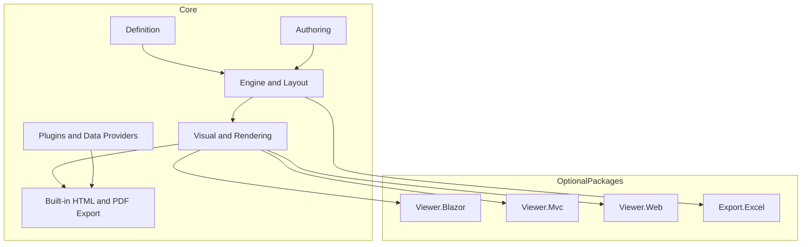

# 03 - Architecture and Project Map

This document maps repository projects to responsibilities.

## Solution Structure

| Project | Responsibility |
|---|---|
| `KineticReports.Core` | Primary runtime package containing domain model, authoring, engine, layout, visual model, rendering, Skia integration, built-in HTML/PDF exporters, plugin runtime, and SQL data providers |
| `KineticReports.Export.Excel` | Excel exporter |
| `KineticReports.Viewer.Web` | ASP.NET viewer hosting |
| `KineticReports.Viewer.Blazor` | Blazor viewer component library |
| `KineticReports.Viewer.Mvc` | MVC viewer package |
| `KineticReports.Samples.Blazor` | Sample application consuming Core + Viewer.Blazor |
| `KineticReports.Samples.Plugins` | Example plugin project under the Plugins folder |

## Architecture Boundaries

## Important Constraints

- Renderer/exporter does not perform layout.
- `ReportDocument` is immutable after arrange/pagination.
- All dimensions are DIPs.
- Shared `ITextLayout` instance should be used across layout and rendering.
