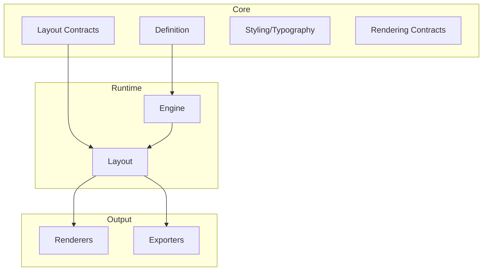

# 03 - Architecture and Project Map

This document maps repository projects to responsibilities.

## Solution Structure

| Project | Responsibility |
|---|---|
| `KineticReports.Core` | Core domain model, geometry, styling, definition, layout element contracts |
| `KineticReports.Engine` | Report orchestration pipeline |
| `KineticReports.Layout` | LayoutSizing/Arrange/Pagination implementation |
| `KineticReports.Rendering` | Backend-agnostic render traversal |
| `KineticReports.Rendering.Skia` | Skia implementation for rendering and text layout |
| `KineticReports.Export.Html` | HTML exporter |
| `KineticReports.Export.Excel` | Excel exporter |
| `KineticReports.Data.SqlServer` | SQL provider implementation |
| `KineticReports.Plugins` | Plugin contracts + manager |
| `KineticReports.Viewer.Web` | ASP.NET viewer hosting |
| `KineticReports.Viewer.Blazor` | Blazor viewer component library |
| `KineticReports.Samples.*` | Sample applications and sample plugins |

## Architecture Boundaries

## Important Constraints

- Renderer/exporter does not perform layout.
- `ReportLayout` is immutable after arrange/pagination.
- All dimensions are DIPs.
- Shared `ITextLayout` instance should be used across layout and rendering.
