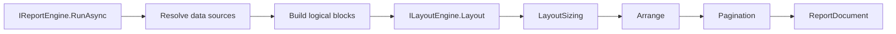

# 05 - Engine and Layout API Reference

This page documents how orchestration and layout contracts work.

## Engine Interfaces

| Interface                | Purpose                                         | Key Methods                       |
| ------------------------ | ----------------------------------------------- | --------------------------------- |
| `IReportEngine`        | Main orchestration entry point                  | `RunAsync(definition)` and `RunAsync(...)` |
| `IDataResolver`        | Resolves rows for each`DataSourceDefinition`  | `ResolveAsync(...)`             |
| `IExpressionEvaluator` | Evaluates expression strings                    | `Evaluate(expression, context)` |
| `IReportBuilder`       | Builds ordered report blocks from resolved data | `Build(dataContext, evaluator)` |

## Engine Runtime Types

| Type                  | Purpose                                          |
| --------------------- | ------------------------------------------------ |
| `ReportEngine`      | Default`IReportEngine` implementation          |
| `DataContext`       | Stores resolved rows keyed by data-source id     |
| `ExpressionContext` | Evaluation context with current row + parameters |
| `LiteralEvaluator`  | Default evaluator behavior                       |

## Dependency Injection

Use the built-in engine registration extension from Core:

```csharp
using KineticReports.Core.Engine.DependencyInjection;

builder.Services.AddKineticReportsEngine();
```

This registers `IExpressionEvaluator`, `IDataResolver`, `IReportBuilder`, `ILayoutEngine`, and `IReportEngine` with default implementations.

To run singleton engine services (for example, in lightweight API hosts):

```csharp
builder.Services.AddKineticReportsEngine(ServiceLifetime.Singleton);
```

You can override any registration afterwards.

## One-Call Execution

Use this when you want the shortest path from `ReportDefinition` to `ReportDocument`:

```csharp
var reportDocument = await reportEngine.RunAsync(definition, cancellationToken);
```

Use the advanced overload when you need explicit parameters, sizing context, or layout options.

## DefaultReportBuilder Fluent API

`DefaultReportBuilder` is a production-capable code-first builder for report blocks.

Common capabilities:
- Static regions: text, image, chart, barcode, shapes, page breaks
- Data-driven regions: row repeaters and expression binding
- Data tables: columns, optional grouping headers, optional footer aggregates

Example:

```csharp
using KineticReports.Core.Engine.Building;
using KineticReports.Core.Layout;

var builder = DefaultReportBuilder.Create()
	.AddTextRegion("title", "Sales by Region", BlockType.ReportHeader)
	.AddDataSourceTable(
		dataSourceId: "orders",
		regionId: "orders-region",
		tableId: "orders-table",
		columns:
		[
			new DefaultReportBuilder.DataSourceTableColumn
			{
				Header = "Region",
				ValueExpression = "{Region}",
				Column = new TableColumn { MinWidth = 120f, Grow = 1f }
			},
			new DefaultReportBuilder.DataSourceTableColumn
			{
				Header = "Amount",
				ValueExpression = "{Amount}",
				Column = new TableColumn { Width = 100f, MinWidth = 100f, Grow = 0f }
			}
		],
		groupByExpression: "{Region}",
		footerAggregates:
		[
			new DefaultReportBuilder.TableAggregateDefinition
			{
				ColumnIndex = 1,
				ValueExpression = "{Amount}",
				Kind = DefaultReportBuilder.TableAggregateKind.Sum,
				FormatString = "0.00"
			}
		],
		footerLabel: "Grand Total");
```

## Layout Interfaces and Types

| Type                    | Kind      | Purpose                           | Key Members                                    |
| ----------------------- | --------- | --------------------------------- | ---------------------------------------------- |
| `ILayoutEngine`       | interface | Turns blocks into`ReportDocument` | `Layout(...)`                                |
| `LayoutEngine`        | class     | Default implementation            | delegates to pagination engine                 |
| `LayoutOptions`       | record    | Page setup and margins            | `PageWidth`, `PageHeight`, `PageMargins` |
| `LayoutSizingContext` | class     | Default LayoutSizing context      | `TextLayout`, image-size resolver            |
| `ReportDocument`        | record    | Final immutable output            | `Pages`                                      |

## Pagination Behavior

- Page headers/footers are partitioned by `BlockType`.
- Body blocks are measured then distributed by available body area.
- `ForcePageBreakBefore` and `KeepTogether` affect page splits.

## Pipeline Diagram



## Junior Tips

- Empty page usually means empty blocks from `IReportBuilder`.
- Data exists but page is empty usually means resolver/tree-builder mismatch on data-source IDs.
