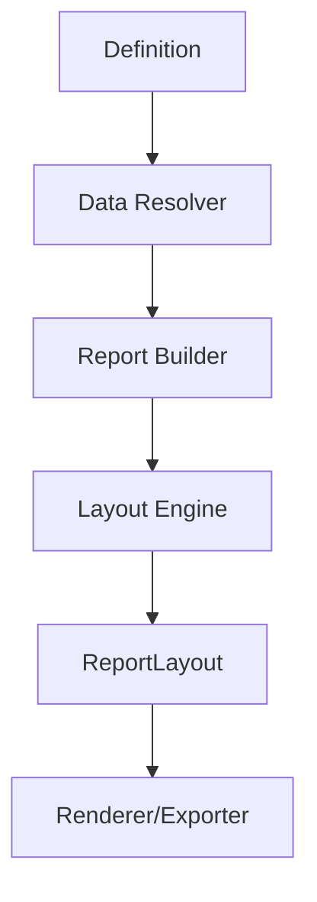

# 07 - Extension Points Cheat Sheet

This is the fastest way to decide where to extend KineticReports.

## Choose Your Extension Point

| You Need To... | Implement | Register In DI | Notes |
|---|---|---|---|
| Pull data from new backend | `IDataResolver` and/or `IDataProvider` | App startup | Resolver maps report data-source definitions to provider calls |
| Add custom expression language features | `IExpressionEvaluator` | App startup | Keep deterministic behavior |
| Build custom report content model | `IReportBuilder` | App startup | Must return ordered `BandElement` list |
| Change page sizing/margins behavior | `LayoutOptions` or custom `ILayoutEngine` | App startup | Respect DIP units |
| Add new render output (PNG/PDF/etc.) | `IRenderer` | App startup | Consume immutable `ReportLayout` only |
| Add new export format | Exporter contract + implementation | App startup | No layout logic in exporter |
| Add optional runtime feature package | `IPlugin` | Plugin manager | Package extension as DLL plugin |

## Lifecycle Boundaries

- Anything before `ReportLayout` can shape content.
- Anything after `ReportLayout` should only present content.

## Common Mistakes

1. Doing layout in exporter/renderer.
2. Mutating layout elements after Arrange.
3. Using mismatched units (pt vs px/DIP).
4. Returning empty bands because IDs do not match resolved data keys.
