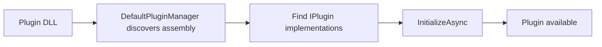

# 08 - Plugin Development Guide (Tutorial + Reference)

## Tutorial: Create a Basic Plugin

## Step 1: Create a class library

- Target `net10.0`
- Reference `KineticReports.Core`

## Step 2: Implement plugin type

Use `PluginBase` for simpler lifecycle handling.

## Step 3: Add metadata + lifecycle hooks

Set `Id`, `Name`, `Version`, and optionally `Author`/`Description`.

## Step 4: Register plugin services

Inside `OnInitializeAsync`, register/resolve services required by your plugin behavior.

## Step 5: Load plugin

Use `IPluginManager.DiscoverAndLoadPluginsAsync(...)` or `LoadPluginAsync(...)`.

## Pipeline Seams for Plugins

Plugins can participate in deterministic seams:

1. **Before layout:** `IReportBlocksPostProcessorPlugin`
2. **Export registry:** `IExportFormatRegistryPlugin`
3. **Export negotiation:** `IExportNegotiationPlugin`
4. **After exporter output:** `IExportArtifactPostProcessorPlugin`
5. **After HTML export:** `IHtmlReportPostProcessorPlugin`

```mermaid
flowchart LR
	A[IReportBuilder.Build] --> B[Report Blocks]
	B --> C[IReportBlocksPostProcessorPlugin]
	C --> D[ILayoutEngine.Layout]
	D --> E[ReportDocument]
	E --> F[IHtmlExporter.ExportAsync]
	F --> G[IExportArtifactPostProcessorPlugin]
	G --> H[IHtmlReportPostProcessorPlugin]
	H --> I[Final HTML]
```

Ordering rules for both seams:

- Plugins run by ascending `Order`.
- Ties are resolved by `Id` using ordinal string comparison.
- This guarantees deterministic output for the same input/plugin set.

## Reference: Plugin API

| Type | Member | Description |
|---|---|---|
| `IPlugin` | `Id` | Unique plugin id |
| `IPlugin` | `Name` | Human-readable display name |
| `IPlugin` | `Version` | Semantic version |
| `IPlugin` | `InitializeAsync(IServiceProvider)` | Called after load |
| `IPlugin` | `UnloadAsync()` | Called before unload |
| `PluginBase` | `OnInitializeAsync()` | Override hook for startup logic |
| `PluginBase` | `OnUnloadAsync()` | Override hook for cleanup logic |
| `IReportBlocksPostProcessorPlugin` | `ProcessBlocks(...)` | Transforms or extends report blocks before layout |
| `IExportFormatRegistryPlugin` | `GetFormats()` | Contributes export format descriptors |
| `IExportNegotiationPlugin` | `Negotiate(...)` | Maps requested format to final format |
| `IExportArtifactPostProcessorPlugin` | `ProcessArtifactAsync(...)` | Transforms exported bytes |
| `IHtmlReportPostProcessorPlugin` | `ProcessHtmlAsync(...)` | Post-processes exported HTML |
| `IPluginManager` | `DiscoverAndLoadPluginsAsync(...)` | Bulk load from folder |
| `IPluginManager` | `UnloadPluginAsync(pluginId)` | Unload one plugin |
| `IReportDocumentExporter` | `Format` + `ExportAsync(...)` | Host-registered exporter for a concrete format |
| `IReportDocumentExporterRegistry` | `TryGetExporter(...)` | Resolves exporter without host conditionals |

Sample host note:

- The Blazor sample now integrates the viewer through `AddKineticReportsViewerBlazor(...)` and `IReportService`.
- Exporter-registry wiring remains available in adapter hosts such as `KineticReports.Viewer.Web`.

Packaging note:

- Plugin contracts and runtime types now ship from `KineticReports.Core`.
- The repository's example plugin lives at `src/Plugins/KineticReports.Samples.Plugins`.

## Example: Implement multiple seams in one plugin

- Implement `IReportBlocksPostProcessorPlugin` to add or transform `ReportBlock`s.
- Implement `IHtmlReportPostProcessorPlugin` to inject HTML/CSS overlays or policies.
- Keep transformations idempotent where possible (safe on repeated runs).

## Example Plugin Ideas

1. Watermark injection hook.
2. Custom data provider registration.
3. Custom exporter registration.
4. Report policy validator.

## Testing Checklist

- Plugin loads without exceptions.
- Metadata values are correct.
- Unload cleans up state.
- Host app works when plugin is missing.
