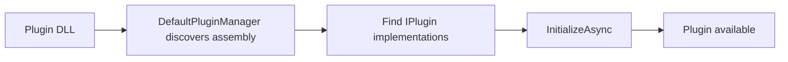

# 08 - Plugin Development Guide (Tutorial + Reference)

## Tutorial: Create a Basic Plugin

## Step 1: Create a class library

- Target `net10.0`
- Reference `KineticReports.Plugins`

## Step 2: Implement plugin type

Use `PluginBase` for simpler lifecycle handling.

## Step 3: Add metadata + lifecycle hooks

Set `Id`, `Name`, `Version`, and optionally `Author`/`Description`.

## Step 4: Register plugin services

Inside `OnInitializeAsync`, register/resolve services required by your plugin behavior.

## Step 5: Load plugin

Use `IPluginManager.DiscoverAndLoadPluginsAsync(...)` or `LoadPluginAsync(...)`.

## Reference: Plugin API

| Type | Member | Description |
|---|---|---|
| `IPlugin` | `Id` | Unique plugin id |
| `IPlugin` | `Name` | Human-readable display name |
| `IPlugin` | `Version` | Semantic version |
| `IPlugin` | `InitializeAsync(IServiceProvider)` | Called after load |
| `IPlugin` | `UnloadAsync()` | Called before unload |
| `PluginBase` | `OnInitializeAsync()` | Override hook for startup logic |
| `PluginBase` | `OnUnloadAsync()` | Override hook for cleanup logic |
| `IPluginManager` | `DiscoverAndLoadPluginsAsync(...)` | Bulk load from folder |
| `IPluginManager` | `UnloadPluginAsync(pluginId)` | Unload one plugin |

## Example Plugin Ideas

1. Watermark injection hook.
2. Custom data provider registration.
3. Custom exporter registration.
4. Report policy validator.

## Testing Checklist

- Plugin loads without exceptions.
- Metadata values are correct.
- Unload cleans up state.
- Host app works when plugin is missing.
