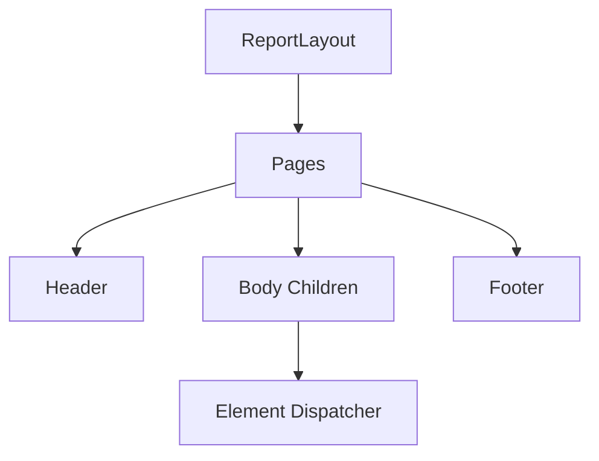

# 09 - Exporter Development Guide (Tutorial + Reference)

## Tutorial: Build a New Exporter

Goal: Convert `ReportLayout` to a new output format.

## Step 1: Create exporter project

- New class library in `src/Export/`
- Reference `KineticReports.Core` (and optionally rendering helpers)

## Step 2: Define exporter contract

Use an interface similar to `IHtmlExporter` with:

- `ExportAsync(ReportLayout reportLayout, Stream output, CancellationToken ct)`

## Step 3: Traverse the report layout

Dispatch on element types (`TextElement`, `ImageElement`, `TableElement`, etc.).

## Step 4: Respect architecture rules

- No layout in exporter.
- Consume element bounds as-is.
- Keep unit consistency (DIP -> output unit mapping).

## Step 5: Register in DI

Add your exporter service in host app startup.

## Reference: Exporter Responsibilities

| Concern | Exporter Must Do | Exporter Must Not Do |
|---|---|---|
| Geometry | Use `Bounds` from report layout | Recalculate bounds |
| Text | Use text runs/style where available | Reflow paragraphs independently |
| Pagination | Iterate pages in order | Repaginate content |
| Styling | Map `ResolvedStyle` safely | Invent unrelated style cascade |

## Suggested Exporter API Table

| Type | Purpose |
|---|---|
| `IYourExporter` | Output format contract |
| `YourExporter` | Concrete implementation |
| `YourStyleMapper` | Map `ResolvedStyle` to format-specific style |
| `YourElementWriter` | Per-element serialization helper |

## Validation Checklist

- Works for single and multiple pages.
- Supports at least text and basic shapes.
- Handles missing/optional element fields gracefully.
- Produces deterministic output for same input.
