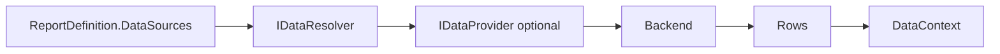

# 10 - Data Provider Development Guide (Tutorial + Reference)

This guide explains how to connect reports to real data.

## Two Common Extension Patterns

1. Implement `IDataResolver` directly (simple app-level mapping).
2. Implement `IDataProvider` and call it from a resolver (more reusable/provider-oriented).

## Tutorial A: Implement `IDataResolver`

### Steps

1. Create class implementing `IDataResolver`.
2. Read `DataSourceDefinition` (`Id`, `ProviderType`, `SourceName`, `Properties`).
3. Fetch rows from backend.
4. Return `IReadOnlyList<IReadOnlyDictionary<string, object?>>`.
5. Register in DI.

## Tutorial B: Implement `IDataProvider`

### Steps

1. Create class implementing `IDataProvider`.
2. Accept `QueryRequest` (`DatasetName`, `QueryText`, `Parameters`).
3. Execute backend query.
4. Return `QueryResult` with schema + rows.
5. Compose resolver that maps report definition to `QueryRequest`.

## Data Flow Diagram

## Reference: Data Contracts

| Type | Purpose | Key Members |
|---|---|---|
| `DataSourceDefinition` | Report-side source declaration | `Id`, `ProviderType`, `SourceName`, `Properties` |
| `IDataResolver` | Engine-side resolution contract | `ResolveAsync(...)` |
| `IDataProvider` | Backend query abstraction | `ExecuteAsync(...)` |
| `QueryRequest` | Provider request model | `DatasetName`, `QueryText`, `Parameters` |
| `QueryResult` | Provider response model | `Schema`, `Rows`, `ExecutionTimeMs` |

## Reliability Checklist

- Return empty list, not null, for no rows.
- Preserve deterministic row ordering.
- Handle cancellation token.
- Do not store secrets in report definitions.
- Validate required `Properties` before querying.
