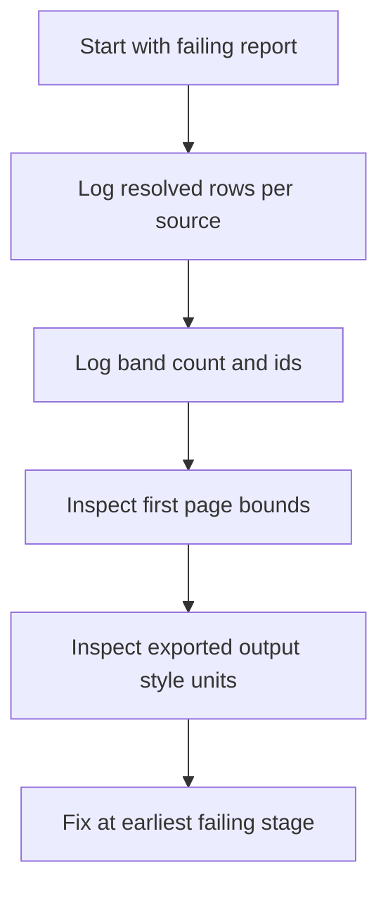

# 11 - Troubleshooting and Debugging

## Symptom: Blank output

Check in this order:

1. Does resolver return rows?
2. Does logical tree builder create bands?
3. Does report layout contain pages and children?
4. Does exporter/renderer map styles/coordinates correctly?

## Symptom: Data exists but not visible

Common causes:
- Coordinate origin errors in nested elements.
- Overflow clipping with wrong relative positions.
- Text color invisible against page background.
- Unit mismatch (`pt` vs `px`/DIP).

## Symptom: Overlapping rows

Common causes:
- Font measurement mismatch with rendered CSS units.
- Line-height differences between layout and output.

## Fast Debug Playbook

## What to Log

- Data-source ID and row count.
- Band IDs and kinds.
- Element bounds (`x,y,w,h`) for first page.
- Final HTML/CSS units for text size and line height.

## Safe Fix Priority

1. Data resolver correctness.
2. Tree builder correctness.
3. Layout engine correctness.
4. Exporter/renderer mapping.
