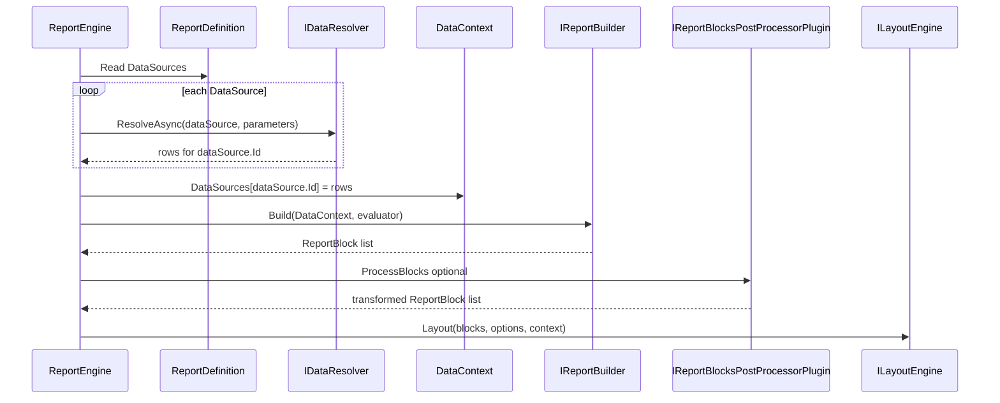
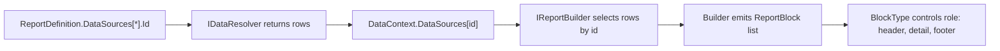

# 13 - Report Authoring, Data Binding, and JSON Workflow

This guide explains three things end-to-end:

1. How a `ReportDefinition` object is generated and used.
2. How data gets associated with that report at runtime.
3. How to package this into a reusable NuGet for Uno/Web apps where users author reports and export/import JSON.

## Why This Matters

A lot of confusion comes from mixing two layers:

1. **Definition layer**: the report specification (`ReportDefinition`) that can be serialized to JSON.
2. **Execution layer**: runtime services (`IDataResolver`, `IReportBuilder`, `ILayoutEngine`, exporter) that turn definition + data into output.

The definition is static metadata. The data association happens at execution time.

For authoring JSON, the source of truth is now `ReportDesignerDocument`.
Compile that authoring contract into runtime artifacts, instead of treating runtime
`ReportDefinition` as the primary editable authoring JSON model.

The key runtime join is:

1. `ReportDefinition.DataSources[*].Id` (authoring-time identifier)
2. `DataContext.DataSources[id]` (runtime row collection)
3. `IReportBuilder.Build(...)` consuming that key to create ordered `ReportBlock` instances

## Mental Model

```mermaid
flowchart LR
  A["User creates ReportDefinition"] --> B["Serialize to JSON"]
  B --> C["Store or transmit JSON"]
  C --> D["Deserialize to ReportDefinition"]
  D --> E["RunAsync with definition, parameters, and context"]
  E --> F["DataResolver resolves rows per data source"]
  F --> G["ReportBuilder creates blocks and elements"]
   G --> H["Optional block post-processing plugins"]
   H --> I["Layout engine computes ReportDocument"]
   I --> J["Exporter renders HTML, PDF, and other outputs"]
```



## Part 1: How the Report Object Is Generated

There are two common generation paths:

1. **Code-first** (what the sample currently does):
   - A builder/factory method creates a `ReportDefinition` in C#.
   - Example: `SampleReports.CreateTableReport()`.
2. **JSON-first**:
   - A JSON document is deserialized into `ReportDefinition`.
   - Useful for user-authored reports and persisted templates.

### Code-First Example

```csharp
var definition = new ReportDefinition
{
    SchemaVersion = "1.0",
    Id = "sales-report",
    Name = "Sales Report",
    Description = "Sales by region",
    DataSources =
    [
        new DataSourceDefinition
        {
            Id = "sales-orders",
            Name = "Sales Orders",
            ProviderType = "SampleInMemory",
            Properties = new Dictionary<string, string>()
        }
    ],
    Parameters = [],
    Styles = []
};
```

### JSON-First Example

```json
{
  "schemaVersion": "1.0",
  "id": "sales-report",
  "name": "Sales Report",
  "description": "Sales by region",
  "parameters": [],
  "dataSources": [
    {
      "id": "sales-orders",
      "name": "Sales Orders",
      "providerType": "SampleInMemory",
      "properties": {}
    }
  ],
  "styles": []
}
```

```csharp
var definition = JsonSerializer.Deserialize<ReportDefinition>(json);
```

### Preferred Authoring JSON Contract

Use `ReportDesignerDocument` as the persisted authoring contract:

1. Build `ReportDesignerDocument` in code (or UI editor)
2. Serialize with `IReportDesignerDocumentSerializer`
3. Deserialize and compile with `IDesignerDocumentCompiler` (or one-call `IDesignerDocumentCompilationService`)
4. Execute runtime pipeline using compiled output + data

```csharp
using KineticReports.Authoring.Documents;
using KineticReports.Authoring.Serialization;
using KineticReports.Authoring.Components;

var document = ReportDesignerDocumentBuilder
   .Create("sales-report", "Sales Report")
   .WithAuthor("Ops Team")
   .AddComponent("header", ReportComponentType.Text, c =>
      c.WithBinding("Text", "Sales Summary")
       .WithPlacement(24, 24, 540, 36))
   .AddComponent("sales-table", ReportComponentType.Table, c =>
      c.BoundToDataSource("sales-orders")
       .WithPlacement(24, 72, 540, 300))
   .Build();

IReportDesignerDocumentSerializer serializer = new SystemTextJsonReportDesignerDocumentSerializer();
var json = serializer.Serialize(document);

var loaded = serializer.Deserialize(json);
```

For a one-call compile pipeline from JSON to runtime definition:

```csharp
using KineticReports.Authoring.Compilation;

IDesignerDocumentCompilationService compilation =
   new DefaultDesignerDocumentCompilationService(
      new SystemTextJsonReportDesignerDocumentSerializer(),
      new DefaultDesignerDocumentCompiler());

var runtimeDefinition = compilation.CompileFromJson(json);
```

In the Blazor sample app, this is wrapped by `IAuthoringJsonWorkflowService`
(`AuthoringJsonWorkflowService`) for an end-to-end flow:

1. Build sample `ReportDesignerDocument`
2. Serialize to JSON
3. Save JSON to disk
4. Load JSON from disk
5. Compile to runtime `ReportDefinition`

```csharp
// Registered in Program.cs via AddScoped<IAuthoringJsonWorkflowService, AuthoringJsonWorkflowService>()
var document = authoringWorkflow.CreateSampleDocument();
await authoringWorkflow.SaveDocumentJsonAsync(document, "reports/sales-report.json", ct);

var definition = await authoringWorkflow.LoadAndCompileAsync("reports/sales-report.json", ct);
```

The sample UI also exposes this flow at route `/authoring-workflow` with buttons for:

1. In-memory workflow (build + serialize + compile)
2. File workflow (save JSON + load JSON + compile)

The page displays generated JSON and compiled metadata for quick inspection.

## Part 2: How Data Is Associated with the Report

Data association is not hard-coded in the definition object itself. It happens by matching:

1. `ReportDefinition.DataSources[*].Id`
2. Runtime resolver behavior in `IDataResolver.ResolveAsync(...)`

### Binding Contract

For each `DataSourceDefinition` in the report:

1. `ReportEngine.RunAsync(...)` calls `IDataResolver.ResolveAsync(dataSource, parameters, ct)`.
2. Resolver returns rows (`IReadOnlyList<IReadOnlyDictionary<string, object?>>`).
3. Rows are stored in `DataContext.DataSources[dataSource.Id]`.
4. `IReportBuilder` consumes those rows and emits ordered `ReportBlock` instances.
5. Optional `IReportBlocksPostProcessorPlugin` implementations can transform blocks before layout.



### Data Source to Block Relationship

At runtime, each row set is keyed by the exact data-source ID from the definition.
The builder uses those keyed rows to create one or more blocks.



Typical mapping patterns:

1. One data source -> one table-oriented detail block
2. One data source -> many grouped blocks (`GroupHeaderBlock` + `DetailBlock`)
3. Multiple data sources -> multiple block sections in a single report

The engine does not infer these mappings automatically; the builder decides block composition.

### Concrete Example: Resolver Side

This example shows how a resolver can return rows for a known source ID.

```csharp
public sealed class SampleResolver : IDataResolver
{
   public Task<IReadOnlyList<IReadOnlyDictionary<string, object?>>> ResolveAsync(
      DataSourceDefinition source,
      IReadOnlyDictionary<string, object?> parameters,
      CancellationToken cancellationToken = default)
   {
      if (string.Equals(source.Id, "sales-orders", StringComparison.OrdinalIgnoreCase))
      {
         IReadOnlyList<IReadOnlyDictionary<string, object?>> rows =
         [
            new Dictionary<string, object?>
            {
               ["OrderId"] = 1001,
               ["Region"] = "North",
               ["Customer"] = "Acme Co",
               ["Total"] = 420.50m,
            },
            new Dictionary<string, object?>
            {
               ["OrderId"] = 1002,
               ["Region"] = "West",
               ["Customer"] = "Globex",
               ["Total"] = 215.00m,
            },
         ];

         return Task.FromResult(rows);
      }

      return Task.FromResult<IReadOnlyList<IReadOnlyDictionary<string, object?>>>([]);
   }
}
```

### Concrete Example: Builder Side

This example reads `sales-orders` rows from `DataContext` and emits one header block plus one detail block per row.

```csharp
public sealed class SampleReportBuilder : IReportBuilder
{
   public IReadOnlyList<ReportBlock> Build(
      DataContext context,
      IExpressionEvaluator evaluator)
   {
      var blocks = new List<ReportBlock>();

      blocks.Add(new HeaderBlock
      {
         Name = "SalesHeader",
         Children =
         [
            new TextBlock
            {
               Id = "title",
               Text = "Sales Orders",
            },
         ],
      });

      var rows = context.GetRows("sales-orders");
      foreach (var row in rows)
      {
         var orderId = row.TryGetValue("OrderId", out var oid) ? oid?.ToString() : string.Empty;
         var customer = row.TryGetValue("Customer", out var c) ? c?.ToString() : string.Empty;
         var total = row.TryGetValue("Total", out var t) ? t?.ToString() : string.Empty;

         blocks.Add(new DetailBlock
         {
            Name = $"Order-{orderId}",
            Children =
            [
               new TextBlock { Id = $"order-{orderId}", Text = $"Order: {orderId}" },
               new TextBlock { Id = $"customer-{orderId}", Text = $"Customer: {customer}" },
               new TextBlock { Id = $"total-{orderId}", Text = $"Total: {total}" },
            ],
         });
      }

      return blocks;
   }
}
```

### Optional Grouping Example

A single source can also produce grouped output by mixing block types:

1. One `GroupHeaderBlock` per region
2. Multiple `DetailBlock` entries within that region
3. One `GroupFooterBlock` for subtotal/summary

The grouping policy remains builder-owned; engine and layout stay generic.

### Practical Rule

If a report source ID is `sales-orders`, then your resolver must return rows for `sales-orders`.

If source IDs and resolver mapping do not align, the report appears empty or partial.

Also ensure the builder looks up the same ID in `DataContext.DataSources`; mismatches there produce the same symptom.

## Part 3: JSON Export/Import for User Authored Reports

You can treat `ReportDefinition` as the portable contract.

### Export Definition to JSON

```csharp
var json = JsonSerializer.Serialize(definition, new JsonSerializerOptions
{
    WriteIndented = true
});
```

### Import Definition from JSON

```csharp
var definition = JsonSerializer.Deserialize<ReportDefinition>(json)
    ?? throw new InvalidOperationException("Invalid report JSON.");
```

### Suggested Validation Before Execution

Validate:

1. `SchemaVersion` exists and is supported.
2. `Id`, `Name` are non-empty.
3. Each `DataSourceDefinition.Id` is unique.
4. Each `ProviderType` is recognized by your resolver strategy.

## Part 4: Recommended NuGet Package Design (Uno/Web Friendly)

If your goal is a reusable package for report authoring + data association + JSON transport, split responsibilities by package.

### Package Layout

1. `KineticReports.Contracts`
   - `ReportDefinition` DTOs
   - JSON serializer options + schema validation
   - No renderer or platform UI dependency

2. `KineticReports.Runtime`
   - `IReportEngine`, `IDataResolver`, `IReportBuilder`
   - Layout and exporter orchestration
   - Extension points

3. `KineticReports.Authoring`
   - Fluent authoring API for end users
   - Helpers for creating sections/tables/groups/expressions
   - Converts fluent model to `ReportDefinition`

4. `KineticReports.Export.*`
   - Html/Excel/PDF/etc. exporters

5. Optional UI helpers:
   - `KineticReports.UI.Uno`
   - `KineticReports.UI.Web`

### Why This Split Works

1. Uno and Web can both reference contracts + runtime.
2. UI-specific editors/viewers remain optional.
3. JSON compatibility is stable and testable independently.

## Part 5: End-to-End Host Integration Pattern

For an Uno/Web host app:

1. User authors report in UI editor.
2. Editor outputs `ReportDefinition`.
3. Persist JSON to DB/file.
4. At runtime, load JSON -> `ReportDefinition`.
5. Resolve data via app-specific `IDataResolver`.
6. Run engine and export.

```csharp
var definition = reportStore.Load(reportId); // JSON -> ReportDefinition
var layout = await reportEngine.RunAsync(definition, parameters, sizingContext, layoutOptions, ct);
await htmlExporter.ExportAsync(layout, outputStream, ct);
```

## Suggested Next Iteration for This Repository

1. Add `KineticReports.Contracts` package with explicit JSON versioning policy.
2. Add `IReportDefinitionSerializer` abstraction (default `System.Text.Json`).
3. Add validation package with clear diagnostics (`ReportValidationResult`).
4. Add sample "definition loaded from JSON" in both Blazor and Console samples.
5. Add compatibility tests for round-trip serialization.

## Implemented Baseline (Current Repository)

The repository now includes a starter authoring NuGet project:

1. `src/Authoring/KineticReports.Authoring/KineticReports.Authoring.csproj`

It provides:

1. Drag-and-drop component contracts (`ReportComponentDefinition`, `ReportComponentType`)
2. A default component catalog (`IReportComponentCatalog`)
3. Designer document model (`ReportDesignerDocument`)
4. Compiler contract + default implementation (`IDesignerDocumentCompiler`)
5. Designer-document JSON serializer abstraction + `System.Text.Json` implementation (`IReportDesignerDocumentSerializer`)
6. Runtime report-definition serializer abstraction + `System.Text.Json` implementation (`IReportDefinitionSerializer`)
7. Fluent code-first authoring builders (`ReportDesignerDocumentBuilder`, `ReportComponentDefinitionBuilder`)
8. One-call compile pipeline (`IDesignerDocumentCompilationService`)
9. DI registration extension (`AddKineticReportsAuthoring`)

The sample app also includes:

1. `IAuthoringJsonWorkflowService` / `AuthoringJsonWorkflowService` for code-first JSON generation and compile workflow

### Authoring Component Groups

The built-in toolbox is split into three groups:

1. Structure
   - `Page`, `Section`, `Panel`, `Group`, `List`, `Table`
2. Content
   - `Text`, `Image`, `Chart`, `Line`, `Rectangle`, `Ellipse`, `Barcode`
3. Supporting
   - `Spacer`, `Divider`, `PageBreak`, `PageNumber`, `TotalPages`, `CurrentDate`, `CurrentTime`, `DocumentInfo`, `Header`, `Footer`, `Background`

This organization is authoring-facing and is intentionally broader than the runtime block model.

### Compile-Time Alias Normalization

`DefaultDesignerDocumentCompiler` now emits canonical compile metadata so alias components can be handled consistently by downstream builders/plugins.

Added metadata keys:

1. `authoring.componentCanonicalTypes`
   - Count summary grouped by canonical kind (`Structure`, `Content`, `Supporting`)
2. `authoring.componentAliases`
   - Map of source component type to canonical type when an alias is used
3. `authoring.compiledComponents`
   - Canonicalized component tree, including preset properties/bindings injected by the compiler

Common alias examples:

1. `List` -> canonical `Group` with repeat-mode metadata
2. `Divider` -> canonical `Line` with `shape.kind=Line`
3. `Spacer` -> canonical `Panel` with `support.role=Spacer`
4. `PageNumber`, `TotalPages`, `CurrentDate`, `CurrentTime` -> canonical `Text` with token bindings
5. `Header` and `Footer` -> canonical `Section` with support-role metadata

The source component type is preserved in compiled metadata (`SourceType`) so tooling can round-trip editor intent.

### Short Code-First Builder Example

For code-first report generation, you can use the fluent Core builder pattern directly:

```csharp
using KineticReports.Core.Layout;
using KineticReports.Core.Styling;

var regionStyle = new AppliedStyle { FontFamily = "Arial", FontSize = 12f };
var headerStyle = new AppliedStyle { FontFamily = "Arial", FontSize = 18f, FontWeight = FontWeight.Bold };
var rowStyle = new AppliedStyle { FontFamily = "Arial", FontSize = 11f };
var headerCellStyle = new AppliedStyle { FontFamily = "Arial", FontSize = 11f, FontWeight = FontWeight.SemiBold };
var dataCellStyle = new AppliedStyle { FontFamily = "Consolas", FontSize = 11f };

var columns = new[]
{
   new TableColumn { Width = 120f },
   new TableColumn { Width = 180f },
   new TableColumn { Width = 120f }
};

var blocks = new ReportLayoutBuilder()
   .AddTextRegion("page-header", BlockType.PageHeader, regionStyle, headerStyle, "Sales Summary")
   .BeginTable("sales-region", regionStyle, "sales-table", regionStyle, columns)
   .AddHeaderRow("sales-header", rowStyle, headerCellStyle, ["OrderId", "Customer", "Amount"])
   .AddDataRow("sales-row-1", rowStyle, dataCellStyle, ["SO-1001", "Contoso", "1250.00"])
   .AddDataRow("sales-row-2", rowStyle, dataCellStyle, ["SO-1002", "Fabrikam", "980.00"])
   .EndTable()
   .Build();
```

This keeps block construction strongly typed while producing the same ordered `IReadOnlyList<ReportBlock>` expected by layout.

The Blazor sample references and registers this package in:

1. `src/Samples/KineticReports.Samples.Blazor/KineticReports.Samples.Blazor.csproj`
2. `src/Samples/KineticReports.Samples.Blazor/Program.cs`

Example registration:

```csharp
builder.Services.AddKineticReportsAuthoring();
```

## Common Pitfalls

1. Assuming data is embedded inside the report definition.
2. Reusing source IDs inconsistently between definition and resolver.
3. Using source IDs correctly in resolver, but differently in builder lookup.
4. Skipping schema/version checks when importing JSON.
5. Coupling authoring UI directly to renderer internals.

## Quick Checklist

Before execution:

1. Definition valid?
2. Data source IDs mapped in resolver?
3. Parameters supplied?
4. Layout sizing context available?
5. Exporter for target format registered?

After execution:

1. `ReportDocument` has expected page count?
2. Export output contains expected content?
3. Trace/log shows each pipeline stage succeeded?
