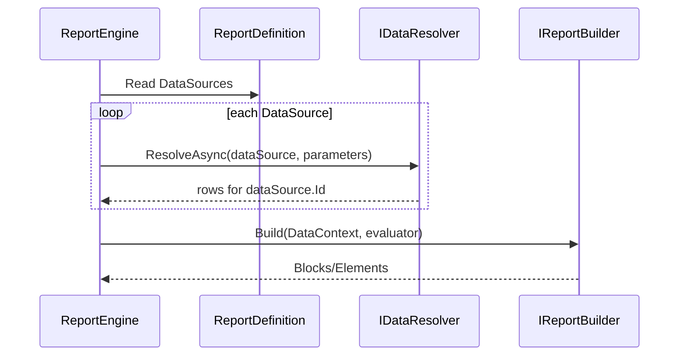

# 13 - Report Authoring, Data Binding, and JSON Workflow

This guide explains three things end-to-end:

1. How a `ReportDefinition` object is generated and used.
2. How data gets associated with that report at runtime.
3. How to package this into a reusable NuGet for Uno/Web apps where users author reports and export/import JSON.

## Why This Matters

A lot of confusion comes from mixing two layers:

1. **Definition layer**: the report specification (`ReportDefinition`) that can be serialized to JSON.
2. **Execution layer**: runtime services (`IDataResolver`, `IReportBuilder`, `ILayoutEngine`, exporter) that turn definition + data into output.

The definition is static metadata. The data association happens at execution time.

## Mental Model

```mermaid
flowchart LR
    A[User creates ReportDefinition] --> B[Serialize to JSON]
    B --> C[Store or transmit JSON]
    C --> D[Deserialize to ReportDefinition]
    D --> E[RunAsync(definition, parameters, context)]
    E --> F[DataResolver resolves rows per DataSource]
    F --> G[ReportBuilder creates blocks/elements]
    G --> H[Layout engine computes ReportLayout]
    H --> I[Exporter renders HTML/PDF/etc]
```

## Part 1: How the Report Object Is Generated

There are two common generation paths:

1. **Code-first** (what the sample currently does):
   - A builder/factory method creates a `ReportDefinition` in C#.
   - Example: `SampleReports.CreateTableReport()`.
2. **JSON-first**:
   - A JSON document is deserialized into `ReportDefinition`.
   - Useful for user-authored reports and persisted templates.

### Code-First Example

```csharp
var definition = new ReportDefinition
{
    SchemaVersion = "1.0",
    Id = "sales-report",
    Name = "Sales Report",
    Description = "Sales by region",
    DataSources =
    [
        new DataSourceDefinition
        {
            Id = "sales-orders",
            Name = "Sales Orders",
            ProviderType = "SampleInMemory",
            Properties = new Dictionary<string, string>()
        }
    ],
    Parameters = [],
    Styles = []
};
```

### JSON-First Example

```json
{
  "schemaVersion": "1.0",
  "id": "sales-report",
  "name": "Sales Report",
  "description": "Sales by region",
  "parameters": [],
  "dataSources": [
    {
      "id": "sales-orders",
      "name": "Sales Orders",
      "providerType": "SampleInMemory",
      "properties": {}
    }
  ],
  "styles": []
}
```

```csharp
var definition = JsonSerializer.Deserialize<ReportDefinition>(json);
```

## Part 2: How Data Is Associated with the Report

Data association is not hard-coded in the definition object itself. It happens by matching:

1. `ReportDefinition.DataSources[*].Id`
2. Runtime resolver behavior in `IDataResolver.ResolveAsync(...)`

### Binding Contract

For each `DataSourceDefinition` in the report:

1. `ReportEngine.RunAsync(...)` calls `IDataResolver.ResolveAsync(dataSource, parameters, ct)`.
2. Resolver returns rows (`IReadOnlyList<IReadOnlyDictionary<string, object?>>`).
3. Rows are stored in `DataContext.DataSources[dataSource.Id]`.
4. `IReportBuilder` consumes those rows and emits layout elements/blocks.



### Practical Rule

If a report source ID is `sales-orders`, then your resolver must return rows for `sales-orders`.

If source IDs and resolver mapping do not align, the report appears empty or partial.

## Part 3: JSON Export/Import for User Authored Reports

You can treat `ReportDefinition` as the portable contract.

### Export Definition to JSON

```csharp
var json = JsonSerializer.Serialize(definition, new JsonSerializerOptions
{
    WriteIndented = true
});
```

### Import Definition from JSON

```csharp
var definition = JsonSerializer.Deserialize<ReportDefinition>(json)
    ?? throw new InvalidOperationException("Invalid report JSON.");
```

### Suggested Validation Before Execution

Validate:

1. `SchemaVersion` exists and is supported.
2. `Id`, `Name` are non-empty.
3. Each `DataSourceDefinition.Id` is unique.
4. Each `ProviderType` is recognized by your resolver strategy.

## Part 4: Recommended NuGet Package Design (Uno/Web Friendly)

If your goal is a reusable package for report authoring + data association + JSON transport, split responsibilities by package.

### Package Layout

1. `KineticReports.Contracts`
   - `ReportDefinition` DTOs
   - JSON serializer options + schema validation
   - No renderer or platform UI dependency

2. `KineticReports.Runtime`
   - `IReportEngine`, `IDataResolver`, `IReportBuilder`
   - Layout and exporter orchestration
   - Extension points

3. `KineticReports.Authoring`
   - Fluent authoring API for end users
   - Helpers for creating sections/tables/groups/expressions
   - Converts fluent model to `ReportDefinition`

4. `KineticReports.Export.*`
   - Html/Excel/PDF/etc. exporters

5. Optional UI helpers:
   - `KineticReports.UI.Uno`
   - `KineticReports.UI.Web`

### Why This Split Works

1. Uno and Web can both reference contracts + runtime.
2. UI-specific editors/viewers remain optional.
3. JSON compatibility is stable and testable independently.

## Part 5: End-to-End Host Integration Pattern

For an Uno/Web host app:

1. User authors report in UI editor.
2. Editor outputs `ReportDefinition`.
3. Persist JSON to DB/file.
4. At runtime, load JSON -> `ReportDefinition`.
5. Resolve data via app-specific `IDataResolver`.
6. Run engine and export.

```csharp
var definition = reportStore.Load(reportId); // JSON -> ReportDefinition
var layout = await reportEngine.RunAsync(definition, parameters, sizingContext, layoutOptions, ct);
await htmlExporter.ExportAsync(layout, outputStream, ct);
```

## Suggested Next Iteration for This Repository

1. Add `KineticReports.Contracts` package with explicit JSON versioning policy.
2. Add `IReportDefinitionSerializer` abstraction (default `System.Text.Json`).
3. Add validation package with clear diagnostics (`ReportValidationResult`).
4. Add sample "definition loaded from JSON" in both Blazor and Console samples.
5. Add compatibility tests for round-trip serialization.

## Implemented Baseline (Current Repository)

The repository now includes a starter authoring NuGet project:

1. `src/Authoring/KineticReports.Authoring/KineticReports.Authoring.csproj`

It provides:

1. Drag-and-drop component contracts (`ReportComponentDefinition`, `ReportComponentType`)
2. A default component catalog (`IReportComponentCatalog`)
3. Designer document model (`ReportDesignerDocument`)
4. Compiler contract + default implementation (`IDesignerDocumentCompiler`)
5. JSON serializer abstraction + `System.Text.Json` implementation (`IReportDefinitionSerializer`)
6. DI registration extension (`AddKineticReportsAuthoring`)

The Blazor sample references and registers this package in:

1. `src/Samples/KineticReports.Samples.Blazor/KineticReports.Samples.Blazor.csproj`
2. `src/Samples/KineticReports.Samples.Blazor/Program.cs`

Example registration:

```csharp
builder.Services.AddKineticReportsAuthoring();
```

## Common Pitfalls

1. Assuming data is embedded inside the report definition.
2. Reusing source IDs inconsistently between definition and resolver.
3. Skipping schema/version checks when importing JSON.
4. Coupling authoring UI directly to renderer internals.

## Quick Checklist

Before execution:

1. Definition valid?
2. Data source IDs mapped in resolver?
3. Parameters supplied?
4. Layout sizing context available?
5. Exporter for target format registered?

After execution:

1. `ReportLayout` has expected page count?
2. Export output contains expected content?
3. Trace/log shows each pipeline stage succeeded?
