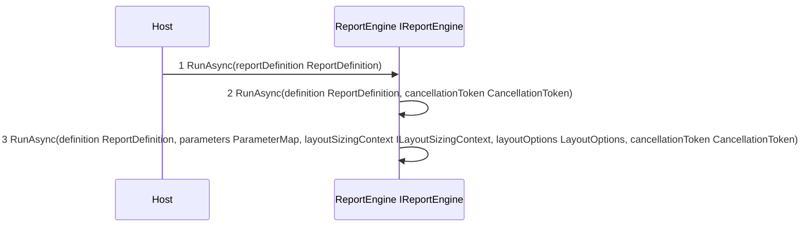
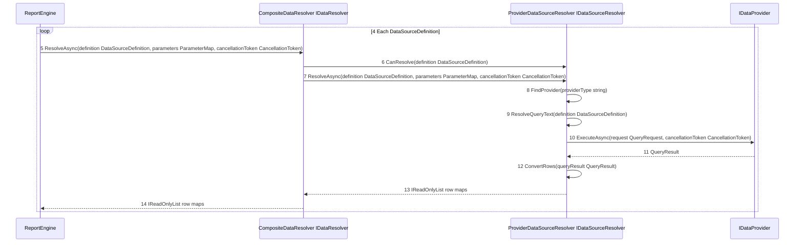
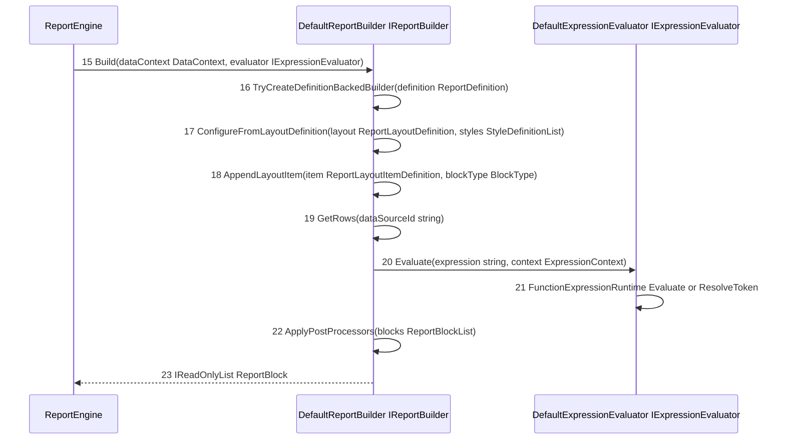
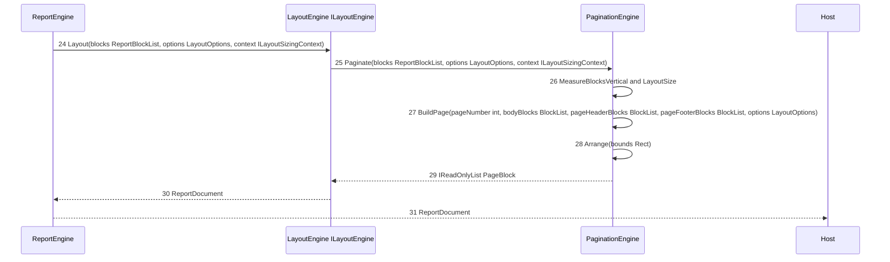

# 14 - RunAsync Execution Call Graph

This document expands the runtime path that starts from any host application call:

```csharp
var reportDocument = await reportEngine.RunAsync(reportDefinition);
```

## Concrete Runtime Chain



### Data Resolution Stage



### Block Building and Expression Stage



### Layout and Return Stage



Type aliases used in the diagrams:
- ParameterMap: string key to object value map
- ReportBlockList: ordered report block collection
- BlockList: ordered layout block collection
- StyleDefinitionList: list of style definitions

## Step by Step Description

1. Caller invokes report generation from the host application by calling the engine.
2. ReportEngine receives the call through IReportEngine and switches to the full overload.
3. CompositeDataResolver iterates each data source in the definition.
4. ProviderDataSourceResolver selects a provider by ProviderType and resolves query text.
5. IDataProvider executes the query request and returns schema and row values.
6. ProviderDataSourceResolver converts provider output into row dictionaries.
7. DefaultReportBuilder builds report blocks from definition layout and resolved data.
8. Builder reads rows and evaluates expressions per row for text, grouping, and aggregates.
9. DefaultExpressionEvaluator resolves function expressions and token expressions.
10. Builder applies post processors to finalize the ordered block list.
11. LayoutEngine starts layout and delegates to PaginationEngine.
12. PaginationEngine measures blocks, computes available body height, and creates pages.
13. PaginationEngine arranges header, body, and footer blocks into final page bounds.
14. The engine returns an immutable ReportDocument to the caller.

## Interface to Implementation Map

| Interface                | Runtime implementation                                 | Primary methods called                                                                                       |
| ------------------------ | ------------------------------------------------------ | ------------------------------------------------------------------------------------------------------------ |
| `IReportEngine`        | `ReportEngine`                                       | `RunAsync(definition: ReportDefinition, cancellationToken: CancellationToken)` -> `RunAsync(definition: ReportDefinition, parameters: IReadOnlyDictionary<string, object?>, layoutSizingContext: ILayoutSizingContext, layoutOptions: LayoutOptions?, cancellationToken: CancellationToken)` |
| `IDataResolver`        | `CompositeDataResolver`                              | `ResolveAsync(definition: DataSourceDefinition, parameters: IReadOnlyDictionary<string, object?>, cancellationToken: CancellationToken)` |
| `IDataSourceResolver`  | `ProviderDataSourceResolver`                         | `CanResolve(definition: DataSourceDefinition)`, `ResolveAsync(definition: DataSourceDefinition, parameters: IReadOnlyDictionary<string, object?>, cancellationToken: CancellationToken)` |
| `IDataProvider`        | provider-specific implementation selected by provider type | `ExecuteAsync(request: QueryRequest, cancellationToken: CancellationToken)` |
| `IReportBuilder`       | `DefaultReportBuilder`                               | `Build(dataContext: DataContext, evaluator: IExpressionEvaluator)`, `ConfigureFromLayoutDefinition(builder: DefaultReportBuilder, layout: ReportLayoutDefinition, styles: IReadOnlyList<StyleDefinition>)`, `ApplyPostProcessors(blocks: IReadOnlyList<ReportBlock>)` |
| `IExpressionEvaluator` | `DefaultExpressionEvaluator`                         | `Evaluate(expression: string, context: ExpressionContext)` |
| `ILayoutEngine`        | `LayoutEngine`                                       | `Layout(blocks: IReadOnlyList<ReportBlock>, options: LayoutOptions, context: ILayoutSizingContext)` |

## Key Source References

- [IReportEngine](../src/Core/KineticReports.Core/Engine/IReportEngine.cs)
- [ReportEngine](../src/Core/KineticReports.Core/Engine/ReportEngine.cs)
- [CompositeDataResolver](../src/Core/KineticReports.Core/Engine/Data/CompositeDataResolver.cs)
- [ProviderDataSourceResolver](../src/Core/KineticReports.Core/Engine/Data/ProviderDataSourceResolver.cs)
- [DefaultReportBuilder](../src/Core/KineticReports.Core/Engine/Building/DefaultReportBuilder.cs)
- [DefaultExpressionEvaluator](../src/Core/KineticReports.Core/Engine/Expressions/DefaultExpressionEvaluator.cs)
- [LayoutEngine](../src/Core/KineticReports.Core/LayoutEngine/LayoutEngine.cs)
- [PaginationEngine](../src/Core/KineticReports.Core/LayoutEngine/Pagination/PaginationEngine.cs)
