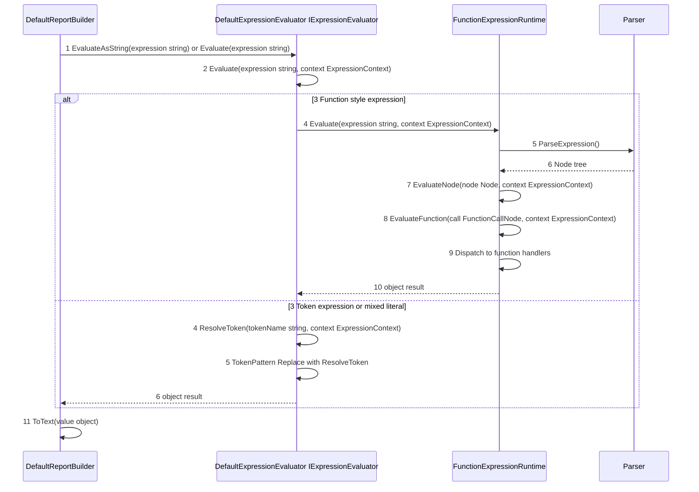
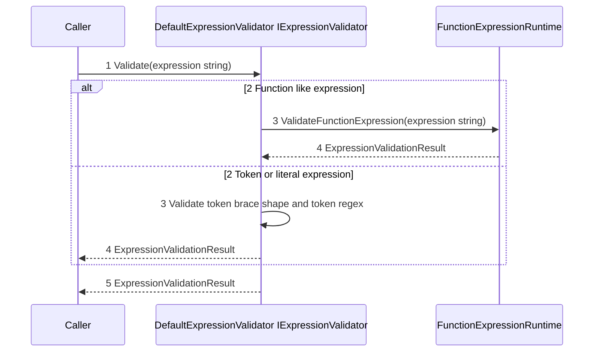

# 15 - Expression Runtime Flow

This document breaks down how expression evaluation executes in the core engine pipeline, regardless of which host application invokes report generation.

## Expression Sub-Pipeline

## Expression Evaluation Walkthrough

1. DefaultReportBuilder asks IExpressionEvaluator for a value.
2. DefaultExpressionEvaluator receives the expression string and context.
3. It decides whether the input is a function-style expression.
4. If function-style, FunctionExpressionRuntime parses and executes the expression tree.
5. Function execution routes to math, string, date, conditional, collection, aggregate, formatting, or report handlers.
6. If not function-style, token resolution is used for direct token values or token replacement in text.
7. The evaluated object result returns to the builder.
8. Builder converts the value to rendering text when needed.

## Methods Involved

| Component                            | Methods involved                                                                                                                                                                                                                                      |
| ------------------------------------ | ----------------------------------------------------------------------------------------------------------------------------------------------------------------------------------------------------------------------------------------------------- |
| `DefaultReportBuilder`             | `EvaluateAsString(evaluator: IExpressionEvaluator, expression: string, context: ExpressionContext)`, `RowBuildContext.Evaluate(expression: string)`, `RowBuildContext.EvaluateAsString(expression: string)`                                     |
| `DefaultExpressionEvaluator`       | `Evaluate(expression: string, context: ExpressionContext)`, `ResolveToken(tokenName: string, context: ExpressionContext)`                                                                                                                         |
| `FunctionExpressionRuntime`        | `LooksLikeFunctionExpression(expression: string)`, `Evaluate(expression: string, context: ExpressionContext)`, `EvaluateNode(node: Node, context: ExpressionContext)`, `EvaluateFunction(call: FunctionCallNode, context: ExpressionContext)` |
| `FunctionExpressionRuntime.Parser` | `ParseExpression()`, `ParseFunctionCall(name: string)`, `ParseArray()`, `ParseToken()`                                                                                                                                                        |

## Validation Path (No Execution)

## Validation Walkthrough

1. DefaultExpressionValidator receives raw expression text.
2. It classifies the input as function-like or token/literal style.
3. Function-like expressions are parsed and semantically validated for known functions and argument counts.
4. Non-function expressions are checked for token-brace structure and placeholder format.
5. A single ExpressionValidationResult is returned with IsValid and error messages.

## Key Source References

- [DefaultExpressionEvaluator](../src/Core/KineticReports.Core/Engine/Expressions/DefaultExpressionEvaluator.cs)
- [FunctionExpressionRuntime](../src/Core/KineticReports.Core/Engine/Expressions/FunctionExpressionRuntime.cs)
- [DefaultExpressionValidator](../src/Core/KineticReports.Core/Engine/Expressions/DefaultExpressionValidator.cs)
- [DefaultReportBuilder](../src/Core/KineticReports.Core/Engine/Building/DefaultReportBuilder.cs)
