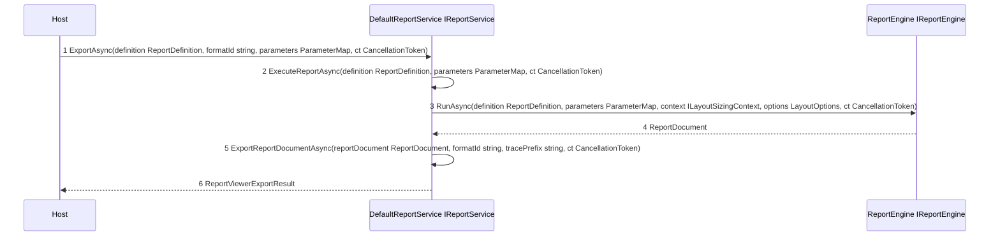
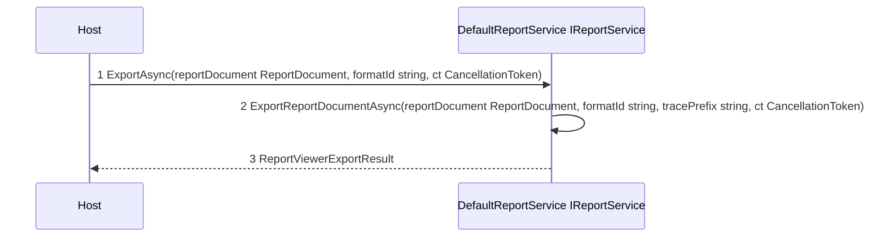
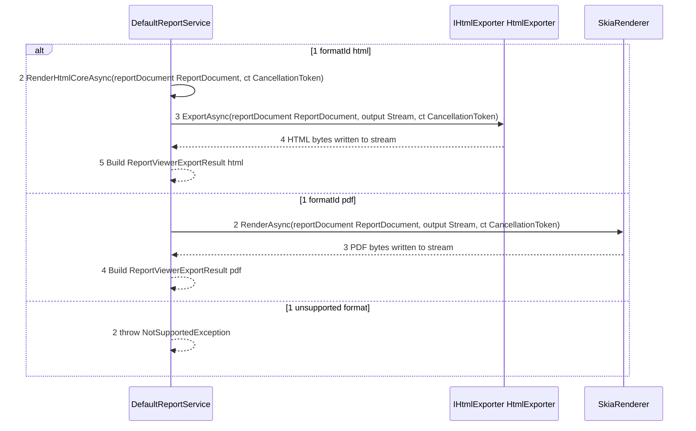
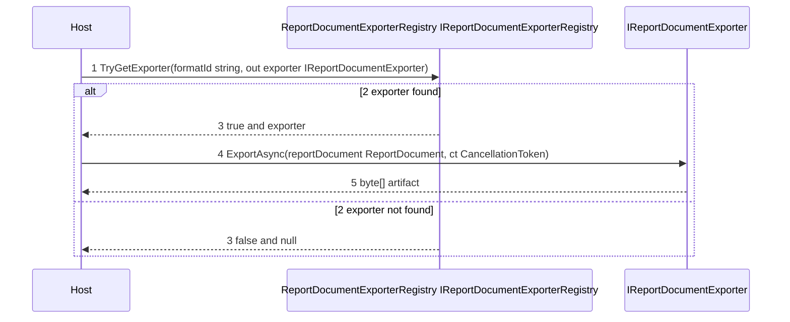
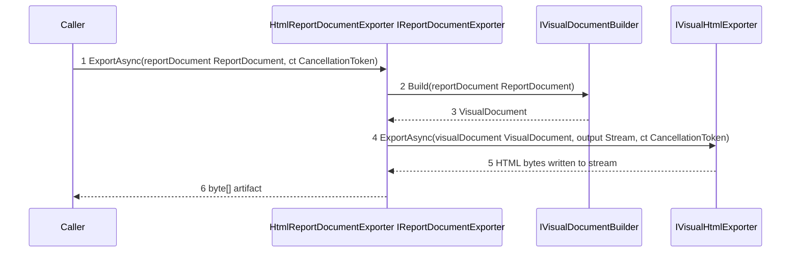
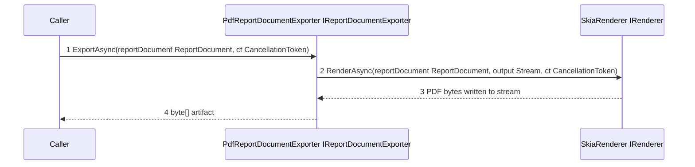

# 16 - Exporter Execution Flow

This document explains how export execution works in host-agnostic terms.

```csharp
var result = await reportService.ExportAsync(reportDocument, formatId, cancellationToken);
```

## Export Runtime Chain

### Service Entry and Report Execution Path



### Service Direct ReportDocument Export Path



### Built In Format Branching in DefaultReportService



## Plugin Registry Export Chain

### Registry Resolution Path



### HtmlReportDocumentExporter Internal Path



### PdfReportDocumentExporter Internal Path



## Step by Step Description

1. Host calls IReportService.ExportAsync with either ReportDefinition or ReportDocument.
2. For ReportDefinition input, DefaultReportService executes the report first using IReportEngine.
3. DefaultReportService routes export by formatId in ExportReportDocumentAsync.
4. HTML format uses IHtmlExporter.ExportAsync and returns UTF8 bytes.
5. PDF format uses SkiaRenderer.RenderAsync and returns PDF bytes.
6. Unsupported format IDs raise NotSupportedException in DefaultReportService.
7. For plugin-style export, the host resolves an exporter from IReportDocumentExporterRegistry.
8. Resolved IReportDocumentExporter performs format-specific export and returns artifact bytes.
9. HtmlReportDocumentExporter converts ReportDocument to VisualDocument and then writes HTML via IVisualHtmlExporter.
10. PdfReportDocumentExporter renders ReportDocument to PDF using SkiaRenderer.

## Interface to Implementation Map

| Interface | Runtime implementation | Primary methods called |
| --- | --- | --- |
| IReportService | DefaultReportService | ExportAsync(definition ReportDefinition, formatId string, parameters ParameterMap, ct CancellationToken), ExportAsync(reportDocument ReportDocument, formatId string, ct CancellationToken) |
| IReportEngine | ReportEngine | RunAsync(definition ReportDefinition, parameters ParameterMap, context ILayoutSizingContext, options LayoutOptions, ct CancellationToken) |
| IHtmlExporter | HtmlExporter | ExportAsync(reportDocument ReportDocument, output Stream, ct CancellationToken) |
| IReportDocumentExporterRegistry | ReportDocumentExporterRegistry | GetAvailableFormats(), TryGetExporter(formatId string, out exporter IReportDocumentExporter) |
| IReportDocumentExporter | HtmlReportDocumentExporter, PdfReportDocumentExporter, plugin exporters | ExportAsync(reportDocument ReportDocument, ct CancellationToken) |
| IVisualDocumentBuilder | host-registered implementation | Build(reportDocument ReportDocument) |
| IVisualHtmlExporter | VisualHtmlExporter | ExportAsync(visualDocument VisualDocument, output Stream, ct CancellationToken) |
| IRenderer | SkiaRenderer | RenderAsync(reportDocument ReportDocument, output Stream, ct CancellationToken) |

Type aliases used in this document:
- ParameterMap: string key to object value map

## Key Source References

- [src/Core/KineticReports.Core/Viewer/Services/IReportService.cs](../src/Core/KineticReports.Core/Viewer/Services/IReportService.cs)
- [src/Core/KineticReports.Core/Viewer/Services/DefaultReportService.cs](../src/Core/KineticReports.Core/Viewer/Services/DefaultReportService.cs)
- [src/Core/KineticReports.Core/Plugins/IReportDocumentExporter.cs](../src/Core/KineticReports.Core/Plugins/IReportDocumentExporter.cs)
- [src/Core/KineticReports.Core/Plugins/IReportDocumentExporterRegistry.cs](../src/Core/KineticReports.Core/Plugins/IReportDocumentExporterRegistry.cs)
- [src/Core/KineticReports.Core/Plugins/ReportDocumentExporterRegistry.cs](../src/Core/KineticReports.Core/Plugins/ReportDocumentExporterRegistry.cs)
- [src/Core/KineticReports.Core/Export/Document/HtmlReportDocumentExporter.cs](../src/Core/KineticReports.Core/Export/Document/HtmlReportDocumentExporter.cs)
- [src/Core/KineticReports.Core/Export/Document/PdfReportDocumentExporter.cs](../src/Core/KineticReports.Core/Export/Document/PdfReportDocumentExporter.cs)
- [src/Core/KineticReports.Core/Export/Html/IHtmlExporter.cs](../src/Core/KineticReports.Core/Export/Html/IHtmlExporter.cs)
- [src/Core/KineticReports.Core/Export/Html/IVisualHtmlExporter.cs](../src/Core/KineticReports.Core/Export/Html/IVisualHtmlExporter.cs)
- [src/Core/KineticReports.Core/Export/Html/HtmlExporter.cs](../src/Core/KineticReports.Core/Export/Html/HtmlExporter.cs)
- [src/Core/KineticReports.Core/Export/Html/VisualHtmlExporter.cs](../src/Core/KineticReports.Core/Export/Html/VisualHtmlExporter.cs)
- [src/Core/KineticReports.Core/Visual/IVisualDocumentBuilder.cs](../src/Core/KineticReports.Core/Visual/IVisualDocumentBuilder.cs)
- [src/Core/KineticReports.Core/Rendering/Skia/SkiaRenderer.cs](../src/Core/KineticReports.Core/Rendering/Skia/SkiaRenderer.cs)
