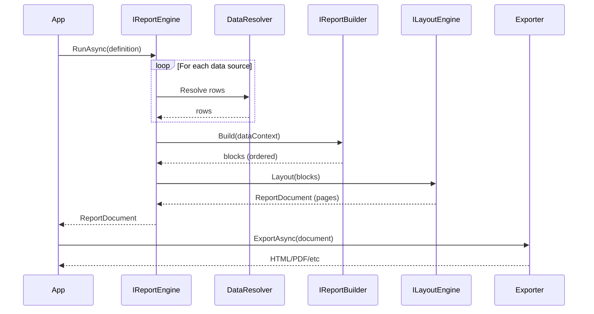

# KineticReports: Complete Developer Guide

**Version:** 1.0.0
**Target Framework:** .NET 10.0
**Audience:** Junior to mid-level developers
**Status:** Initial Release

---

## Table of Contents

1. [Introduction &amp; Overview](#1-introduction--overview)
2. [Core Concepts](#2-core-concepts)
3. [Project Architecture](#3-project-architecture)
4. [Report Generation Pipeline](#4-report-generation-pipeline)
5. [Core APIs &amp; Types](#5-core-apis--types)
6. [Getting Started: Code Examples](#6-getting-started-code-examples)
7. [Building Reports Programmatically](#7-building-reports-programmatically)
8. [Styling &amp; Appearance](#8-styling--appearance)
9. [Data Binding &amp; Parameters](#9-data-binding--parameters)
10. [Extending KineticReports](#10-extending-kinetic-reports)
11. [Common Patterns &amp; Best Practices](#11-common-patterns--best-practices)
12. [Troubleshooting &amp; Debugging](#12-troubleshooting--debugging)
13. [Future Compatibility &amp; Design Decisions](#13-future-compatibility--design-decisions)
14. [Glossary](#14-glossary)

---

## 1. Introduction & Overview

### What is KineticReports?

KineticReports is a **deterministic reporting engine for .NET 10**. It transforms report definitions and data into beautifully formatted documents that can be:

- Viewed in Blazor web applications
- Exported to HTML, PDF, and other formats
- Searched and analyzed programmatically
- Extended with custom plugins and providers

### Key Characteristics

- **Deterministic:** Same input produces identical output every time
- **Cross-Platform:** Runs on Windows, Linux, macOS
- **UI-Agnostic:** No dependency on specific UI frameworks
- **Extensible:** Plugins, custom exporters, data providers, and more
- **Performance:** Optimized with enum-based type dispatch for fast rendering

### The Basic Flow

```
ReportDefinition (input)
    ↓
Fetch Data (from database, API, etc.)
    ↓
Build Report Blocks (transform data into layout elements)
    ↓
Layout & Pagination (compute positions and split pages)
    ↓
ReportDocument (immutable final model)
    ↓
Export/Render (HTML, PDF, etc.)
```

### Minimal Code Example

```csharp
// Get the report engine from dependency injection
var engine = serviceProvider.GetRequiredService<IReportEngine>();

// Define your report
var definition = new ReportDefinition { /* ... */ };

// Execute: data → blocks → layout → document
var document = await engine.RunAsync(definition);

// Export to HTML (or any format)
var exporter = serviceProvider.GetRequiredService<IReportDocumentExporter>();
var stream = new MemoryStream();
await exporter.ExportAsync(document, stream);
```

---

## 2. Core Concepts

### 2.1 ReportDefinition

The **input** to the reporting engine. Describes what report to create.

```csharp
var definition = new ReportDefinition
{
    Id = "sales-report",
    Name = "Monthly Sales Report",
    SchemaVersion = "1.0",
    Parameters = new[]
    {
        new ParameterDefinition { Id = "month", Name = "Month", Type = "string" }
    },
    DataSources = new[]
    {
        new DataSourceDefinition { Id = "sales", ProviderType = "SqlServer", SourceName = "sp_GetSales" }
    },
    Blocks = new[] { /* content blocks */ }
};
```

**Key Properties:**

- `Id` - Unique identifier
- `Name` - Display name
- `Parameters` - Input parameters (filters, dates, etc.)
- `DataSources` - Where to get data from
- `Blocks` - Report structure and content

### 2.2 DataContext

The **runtime resolved data** for a specific report execution.

After data resolution, you have:

```csharp
var dataContext = new DataContext
{
    ["sales"] = new[] { /* rows from SQL query */ },
    ["regions"] = new[] { /* rows from API */ }
};
```

This is passed to the report builder so block creation can iterate through data and create content.

### 2.3 ContentBlock (v1.0.0+)

The **single unified layout element** type. All report content is represented as `ContentBlock` instances, differentiated by the `BlockContentType` enum.

**Example:**

```csharp
// Text block
var textBlock = new ContentBlock
{
    Id = "title",
    ContentType = BlockContentType.Text,
    Text = "Monthly Sales Report",
    Style = defaultStyle
};

// Image block
var imageBlock = new ContentBlock
{
    Id = "logo",
    ContentType = BlockContentType.Image,
    SourceKey = "images/logo.png"
};

// Container (holds other blocks)
var container = new ContentBlock
{
    Id = "section1",
    ContentType = BlockContentType.Container,
    Children = new[] { textBlock, imageBlock }
};

// Table
var table = new ContentBlock
{
    ContentType = BlockContentType.Table,
    Children = new[] { /* rows */ }
};
```

**All 12 Block Types (now unified as ContentBlock):**

| BlockContentType  | Purpose                                   | Typical Usage                    |
| ----------------- | ----------------------------------------- | -------------------------------- |
| `Text`          | Text content                              | Paragraphs, labels, dynamic text |
| `Image`         | Raster/vector images                      | Photos, logos, backgrounds       |
| `Shape`         | Vector shapes (rectangle, circle, line)   | Dividers, decorative elements    |
| `Chart`         | Data visualizations                       | Bar/pie/line charts              |
| `Barcode`       | Machine-readable codes                    | QR codes, barcodes               |
| `Container`     | Generic children container                | Layout sections                  |
| `Table`         | Tabular data container                    | Data tables                      |
| `Row`           | Table row                                 | Row within table                 |
| `Cell`          | Table cell                                | Cell content with merge support  |
| `ReportSection` | Logical report region (pre-pagination)    | Headers, detail, footers         |
| `PageSection`   | Physical page structure (post-pagination) | Page headers/footers             |
| `Page`          | One final page                            | Output page                      |

### 2.4 ReportDocument

The **immutable final output** of layout and pagination. This is what gets rendered or exported.

```csharp
var document = new ReportDocument
{
    Pages = new[]
    {
        new ContentBlock
        {
            ContentType = BlockContentType.Page,
            Children = new[] { /* page content */ }
        }
    },
    Metadata = new Dictionary<string, object>()
};
```

**Important:** Once layout is complete, `ReportDocument` cannot be modified. Exporters and renderers consume it as read-only.

### 2.5 Device Independent Pixels (DIPs)

All coordinates and sizes in KineticReports are in **Device Independent Pixels (DIPs)**.

- **1 DIP = 1/96 inch**
- This is consistent across all screens, DPIs, and outputs
- When measuring text or images, always work in DIPs
- When converting to/from pixels, multiply by screen DPI

### 2.6 AppliedStyle

The **final computed style** for an element after:

1. Default theme styles applied
2. Named styles inherited
3. Parent styles cascaded down
4. Local overrides applied

```csharp
var style = new AppliedStyle
{
    FontFamily = "Arial",
    FontSize = 12f,
    FontWeight = FontWeight.Normal,
    TextColor = Color.Black,
    Background = Color.White,
    Padding = new Thickness(10f, 10f, 10f, 10f),
    Margin = new Thickness(0f, 8f, 0f, 8f)
};
```

---

## 3. Project Architecture

### 3.1 Solution Structure

```
KineticReports.slnx
├── src/Core/
│   └── KineticReports.Core/
│       ├── Authoring/          - JSON/fluent report builders
│       ├── Definition/         - ReportDefinition, ParameterDefinition
│       ├── Layout/             - Layout engine, ContentBlock
│       ├── Rendering/          - Rendering contracts, text layout
│       ├── Styling/            - Colors, fonts, styles
│       ├── Typography/         - Text measurement and shaping
│       ├── Engine/             - IReportEngine orchestration
│       ├── Data/               - Data providers and resolvers
│       ├── Export/             - Built-in HTML/PDF exporters
│       └── Plugins/            - Plugin infrastructure
│
├── src/Viewer/
│   ├── KineticReports.Viewer.Blazor/   - Blazor components
│   ├── KineticReports.Viewer.Web/      - ASP.NET Core viewer host
│   └── KineticReports.Viewer.Mvc/      - MVC viewer package
│
├── src/Plugins/
│   └── KineticReports.Samples.Plugins/ - Example plugins
│
└── tests/
    ├── unit-tests/                      - Fast unit tests
    └── integration-tests/               - End-to-end tests
```

### 3.2 Package Dependencies

```
┌─────────────────────────────┐
│   App / Viewer              │
└─────────────────────────────┘
            ↓
┌─────────────────────────────┐
│ KineticReports.Core (v1.0.0)│  ← Single integrated package
├─────────────────────────────┤
│ - Authoring & Definition    │
│ - Engine & Layout           │
│ - Rendering & Export        │
│ - Plugins & Data Providers  │
└─────────────────────────────┘
            ↓
┌─────────────────────────────┐
│  .NET 10.0, SkiaSharp 4.x   │
└─────────────────────────────┘
```

**Optional add-ons:**

- `KineticReports.Viewer.Blazor` - For web viewers

### 3.3 Typical Application Structure

```csharp
// Startup/DI configuration
services.AddKineticReports();  // Registers all core services
services.AddScoped<IDataResolver, MyCustomDataResolver>();
services.AddScoped<IExporter, MyCustomExporter>();

// Usage in a controller/component
public class ReportController
{
    private readonly IReportEngine _engine;
    public ReportController(IReportEngine engine) => _engine = engine;

    public async Task<IActionResult> GenerateReport()
    {
        var definition = LoadReportDefinition("sales-report.json");
        var document = await _engine.RunAsync(definition);
        var html = await ExportToHtml(document);
        return Content(html, "text/html");
    }
}
```

---

## 4. Report Generation Pipeline

### 4.1 High-Level Flow



### 4.2 Stage 1: Data Resolution

The engine fetches data from all configured sources.

```csharp
// From ReportDefinition
var dataSources = definition.DataSources; // Array of DataSourceDefinition

// For each source, resolver is called
foreach (var source in dataSources)
{
    var rows = await dataResolver.ResolveAsync(source, parameters);
    dataContext[source.Id] = rows;
}
```

**What happens:**

- Each `DataSourceDefinition` is mapped to a data provider
- Parameters are passed (filters, dates, etc.)
- Rows are returned and stored by source ID

### 4.3 Stage 2: Report Block Building

The report builder transforms data into an ordered list of layout blocks.

```csharp
// Input: data context with resolved rows
var blocks = await reportBuilder.Build(dataContext, expressionEvaluator);
// Output: IReadOnlyList<ContentBlock>
```

**What happens:**

- Iterate through resolved data rows
- For each row, create layout blocks (text, images, containers)
- Handle expressions (formulas, filters, aggregates)
- Return ordered block list

### 4.4 Stage 3: Layout & Pagination

The layout engine computes positions and splits content across pages.

```
Input:  IReadOnlyList<ContentBlock>  (unpositioned blocks)
    ↓
LayoutSizing Pass:  Compute desired sizes
    ↓
Arrange Pass:  Assign final bounds (x, y, width, height)
    ↓
Pagination Pass:  Split into pages
    ↓
Output: ReportDocument (immutable pages)
```

**LayoutSizing Phase:**

- Each block reports its `DesiredSize`
- Container blocks calculate size from children
- Text blocks use `ITextLayout` to measure
- Image blocks report their natural size

**Arrange Phase:**

- Each block receives final `Bounds` (position + size)
- Container blocks arrange children within their bounds
- Layout is now immutable

**Pagination Phase:**

- Content is split into pages based on page height
- Page headers/footers are added to each page
- Orphan/widow handling (if configured)

### 4.5 Stage 4: Export/Render

The document is converted to output format.

```csharp
var exporter = serviceProvider.GetRequiredService<IReportDocumentExporter>();

// HTML export
await exporter.ExportAsync(document, htmlStream);

// Or render to graphics
var renderer = serviceProvider.GetRequiredService<IRenderer>();
await renderer.RenderAsync(document, pdfStream, renderOptions);
```

**Important Rules:**

- Exporter/renderer receives **immutable** `ReportDocument`
- No layout changes are allowed
- Only presentation/format conversion happens
- Output is deterministic (same input = same output)

---

## 5. Core APIs & Types

### 5.1 Key Interfaces

#### IReportEngine

Orchestrates the entire pipeline from definition to document.

```csharp
public interface IReportEngine
{
    Task<ReportDocument> RunAsync(
        ReportDefinition definition,
        CancellationToken cancellationToken = default);

    Task<ReportDocument> RunAsync(
        ReportDefinition definition,
        Dictionary<string, object>? runtimeParameters,
        ILayoutSizingContext? layoutContext,
        LayoutOptions? layoutOptions,
        CancellationToken cancellationToken = default);
}
```

#### IDataResolver

Maps data source definitions to concrete data.

```csharp
public interface IDataResolver
{
    Task<IReadOnlyList<Dictionary<string, object>>> ResolveAsync(
        DataSourceDefinition source,
        Dictionary<string, object>? parameters,
        CancellationToken cancellationToken = default);
}
```

#### IReportBuilder

Transforms data and definitions into report blocks.

```csharp
public interface IReportBuilder
{
    Task<IReadOnlyList<ContentBlock>> BuildAsync(
        ReportDefinition definition,
        DataContext dataContext,
        IExpressionEvaluator evaluator,
        CancellationToken cancellationToken = default);
}
```

#### ILayoutEngine

Computes positions and paginates content.

```csharp
public interface ILayoutEngine
{
    Task<ReportDocument> LayoutAsync(
        IReadOnlyList<ContentBlock> blocks,
        ILayoutSizingContext sizingContext,
        LayoutOptions? options = null,
        CancellationToken cancellationToken = default);
}
```

#### IRenderer & IReportDocumentExporter

Output conversion.

```csharp
public interface IRenderer
{
    Task RenderAsync(
        ReportDocument document,
        Stream output,
        RenderOptions? options = null,
        CancellationToken cancellationToken = default);
}

public interface IReportDocumentExporter
{
    string FormatId { get; }
    Task ExportAsync(
        ReportDocument document,
        Stream output,
        CancellationToken cancellationToken = default);
}
```

### 5.2 Key Types

#### ContentBlock (v1.0.0+)

```csharp
public sealed class ContentBlock : LayoutBlock
{
    // Identity
    public string Id { get; init; } = "";
  
    // Type discriminator
    public BlockContentType ContentType { get; init; }
  
    // Styling
    public required AppliedStyle Style { get; init; }
  
    // Layout
    public Rect Bounds { get; set; }
    public Size DesiredSize { get; set; }
  
    // Hierarchy
    public IReadOnlyList<ContentBlock> Children { get; init; } = [];
  
    // Type-specific properties
    public string? Text { get; init; }
    public IReadOnlyList<TextRun>? TextRuns { get; init; }
    public string? SourceKey { get; init; }
    public ShapeKind Kind { get; init; }
    public Color? Fill { get; init; }
    public Color? Stroke { get; init; }
    public float StrokeWidth { get; init; }
    public string? ChartType { get; init; }
    public object? ChartData { get; init; }
    public int ColumnIndex { get; init; }
    public int ColSpan { get; init; }
    public int RowSpan { get; init; }
    public string? Symbology { get; init; }
    public string? Value { get; init; }
    public bool ShowText { get; init; }
}
```

#### BlockContentType Enum

```csharp
public enum BlockContentType
{
    Text,           // Text content
    Image,          // Images
    Shape,          // Shapes (rectangle, ellipse, line)
    Chart,          // Charts
    Barcode,        // Barcodes/QR codes
    Container,      // Generic container
    Table,          // Table root
    Row,            // Table row
    Cell,           // Table cell
    ReportSection,  // Logical section (pre-pagination)
    PageSection,    // Physical section (post-pagination)
    Page            // One page
}
```

#### ReportDefinition

```csharp
public record ReportDefinition
{
    public string SchemaVersion { get; init; } = "1.0";
    public string Id { get; init; } = "";
    public string Name { get; init; } = "";
  
    public IReadOnlyList<ParameterDefinition> Parameters { get; init; } = [];
    public IReadOnlyList<DataSourceDefinition> DataSources { get; init; } = [];
    public IReadOnlyList<StyleDefinition> Styles { get; init; } = [];
    public IReadOnlyList<ReportPluginToggleDefinition> Plugins { get; init; } = [];
  
    // Blocks or JSON source
    public IReadOnlyList<object>? Blocks { get; init; }
    public string? Source { get; init; }
}
```

#### AppliedStyle

```csharp
public sealed record AppliedStyle
{
    public required string FontFamily { get; init; }
    public required float FontSize { get; init; }
  
    public FontWeight FontWeight { get; init; } = FontWeight.Normal;
    public TextDecoration TextDecoration { get; init; } = TextDecoration.None;
    public TextAlignment TextAlignment { get; init; } = TextAlignment.Left;
  
    public Color TextColor { get; init; } = Color.Black;
    public Color? Background { get; init; }
  
    public Thickness Padding { get; init; } = Thickness.Zero;
    public Thickness Margin { get; init; } = Thickness.Zero;
  
    public float LineHeight { get; init; } = 1.2f;
    public float? LetterSpacing { get; init; }
}
```

---

## 6. Getting Started: Code Examples

### 6.1 Simple Report with Static Content

```csharp
using KineticReports.Core.Definition;
using KineticReports.Core.Layout;
using KineticReports.Core.Styling;
using KineticReports.Core.Geometry;

var definition = new ReportDefinition
{
    Id = "simple",
    Name = "Simple Report",
    Blocks = new object[]
    {
        new ContentBlock
        {
            Id = "title",
            ContentType = BlockContentType.Text,
            Text = "Monthly Sales Report",
            Style = new AppliedStyle
            {
                FontFamily = "Arial",
                FontSize = 24f,
                FontWeight = FontWeight.Bold,
                TextAlignment = TextAlignment.Center
            }
        },
        new ContentBlock
        {
            Id = "subtitle",
            ContentType = BlockContentType.Text,
            Text = "October 2024",
            Style = new AppliedStyle
            {
                FontFamily = "Arial",
                FontSize = 14f,
                TextColor = Color.Gray
            }
        },
        new ContentBlock
        {
            Id = "body",
            ContentType = BlockContentType.Text,
            Text = "This report summarizes sales performance.",
            Style = new AppliedStyle
            {
                FontFamily = "Arial",
                FontSize = 12f,
                LineHeight = 1.5f
            }
        }
    }
};

// Run the report
var engine = serviceProvider.GetRequiredService<IReportEngine>();
var document = await engine.RunAsync(definition);

// Export to HTML
var exporter = serviceProvider.GetRequiredService<IReportDocumentExporter>();
using var stream = new MemoryStream();
await exporter.ExportAsync(document, stream);
var html = Encoding.UTF8.GetString(stream.ToArray());
```

### 6.2 Data-Driven Report with Tables

```csharp
// Define data source
var definition = new ReportDefinition
{
    Id = "data-report",
    Name = "Sales Data Report",
    DataSources = new[]
    {
        new DataSourceDefinition
        {
            Id = "sales",
            Name = "Sales Data",
            ProviderType = "SqlServer",
            SourceName = "SELECT SalesId, ProductName, Amount FROM Sales"
        }
    },
    Blocks = new object[]
    {
        new ContentBlock
        {
            Id = "title",
            ContentType = BlockContentType.Text,
            Text = "Sales Report",
            Style = defaultTitleStyle
        },
        new ContentBlock
        {
            Id = "table",
            ContentType = BlockContentType.Table,
            Children = new[]
            {
                // Header row
                new ContentBlock
                {
                    ContentType = BlockContentType.Row,
                    Children = new[]
                    {
                        CellBlock("Sale ID", headerStyle),
                        CellBlock("Product", headerStyle),
                        CellBlock("Amount", headerStyle)
                    }
                }
                // Data rows will be created by IReportBuilder
            }
        }
    }
};

// Helper to create cell
static ContentBlock CellBlock(string text, AppliedStyle style) =>
    new ContentBlock
    {
        ContentType = BlockContentType.Cell,
        Children = new[]
        {
            new ContentBlock
            {
                ContentType = BlockContentType.Text,
                Text = text,
                Style = style
            }
        }
    };
```

### 6.3 Report with Parameters

```csharp
var definition = new ReportDefinition
{
    Id = "filtered-report",
    Name = "Filtered Sales Report",
    Parameters = new[]
    {
        new ParameterDefinition
        {
            Id = "startDate",
            Name = "Start Date",
            Type = "DateTime",
            IsRequired = true
        },
        new ParameterDefinition
        {
            Id = "endDate",
            Name = "End Date",
            Type = "DateTime",
            IsRequired = true
        }
    },
    DataSources = new[]
    {
        new DataSourceDefinition
        {
            Id = "sales",
            Name = "Sales Data",
            ProviderType = "SqlServer",
            SourceName = "sp_GetSalesByDateRange",
            Properties = new Dictionary<string, object>
            {
                ["startDateParam"] = "${Parameters.startDate}",
                ["endDateParam"] = "${Parameters.endDate}"
            }
        }
    },
    Blocks = new object[] { /* blocks */ }
};

// Execute with parameters
var engine = serviceProvider.GetRequiredService<IReportEngine>();
var parameters = new Dictionary<string, object>
{
    ["startDate"] = new DateTime(2024, 1, 1),
    ["endDate"] = new DateTime(2024, 12, 31)
};

var document = await engine.RunAsync(definition, parameters);
```

---

## 7. Building Reports Programmatically

### 7.1 Using ContentBlockFactory

The factory provides a type-safe API for creating blocks:

```csharp
using KineticReports.Core.Layout;

// Text
var textBlock = ContentBlockFactory.CreateText(
    text: "Hello World",
    style: defaultStyle);

// Image
var imageBlock = ContentBlockFactory.CreateImage(
    sourceKey: "images/logo.png",
    stretch: ImageStretch.Uniform,
    style: defaultStyle);

// Shapes
var rectBlock = ContentBlockFactory.CreateRectangle(
    fill: Color.White,
    stroke: Color.Black,
    strokeWidth: 2f,
    style: defaultStyle);

var ellipseBlock = ContentBlockFactory.CreateEllipse(
    fill: Color.Blue,
    stroke: null,
    style: defaultStyle);

var lineBlock = ContentBlockFactory.CreateLine(
    stroke: Color.Gray,
    strokeWidth: 1f,
    style: defaultStyle);

// Barcodes
var qrBlock = ContentBlockFactory.CreateQrCode(
    value: "https://example.com",
    style: defaultStyle);

var barcodeBlock = ContentBlockFactory.CreateBarcode(
    symbology: "Code128",
    value: "123456789",
    showText: true,
    style: defaultStyle);

// Container
var container = ContentBlockFactory.CreateContainer(
    children: new[] { textBlock, imageBlock },
    style: defaultStyle);

// Chart
var chartBlock = ContentBlockFactory.CreateChart(
    chartType: "BarChart",
    chartData: chartDataObject,
    style: defaultStyle);
```

### 7.2 Using ReportLayoutBuilder (Fluent API)

```csharp
using KineticReports.Core.Layout;

var builder = new ReportLayoutBuilder();

builder
    .Add(ContentBlockFactory.CreateText("Sales Report", titleStyle))
    .AddPageBreak()
    .BeginTable()
        .AddHeaderRow(
            ("Product", headerStyle),
            ("Quantity", headerStyle),
            ("Price", headerStyle))
        .AddDataRow(
            ("Widget A", defaultStyle),
            ("100", defaultStyle),
            ("$25.00", defaultStyle))
        .AddDataRow(
            ("Widget B", defaultStyle),
            ("50", defaultStyle),
            ("$50.00", defaultStyle))
    .EndTable();

var blocks = builder.Build();
```

### 7.3 Custom IReportBuilder Implementation

```csharp
public class SalesReportBuilder : IReportBuilder
{
    private readonly IExpressionEvaluator _evaluator;
  
    public SalesReportBuilder(IExpressionEvaluator evaluator)
    {
        _evaluator = evaluator;
    }
  
    public async Task<IReadOnlyList<ContentBlock>> BuildAsync(
        ReportDefinition definition,
        DataContext dataContext,
        IExpressionEvaluator evaluator,
        CancellationToken cancellationToken = default)
    {
        var blocks = new List<ContentBlock>();
      
        // Add title
        blocks.Add(ContentBlockFactory.CreateText(
            definition.Name,
            titleStyle));
      
        // Add table from data
        if (dataContext.TryGetValue("sales", out var salesRows))
        {
            var tableBlock = BuildSalesTable(salesRows);
            blocks.Add(tableBlock);
        }
      
        return blocks;
    }
  
    private ContentBlock BuildSalesTable(IReadOnlyList<Dictionary<string, object>> rows)
    {
        var rowBlocks = new List<ContentBlock>();
      
        // Header
        rowBlocks.Add(new ContentBlock
        {
            ContentType = BlockContentType.Row,
            Children = new[]
            {
                CreateCell("Product", headerStyle),
                CreateCell("Amount", headerStyle)
            }
        });
      
        // Data rows
        foreach (var row in rows)
        {
            rowBlocks.Add(new ContentBlock
            {
                ContentType = BlockContentType.Row,
                Children = new[]
                {
                    CreateCell(row["ProductName"].ToString(), dataStyle),
                    CreateCell(row["Amount"].ToString(), dataStyle)
                }
            });
        }
      
        return new ContentBlock
        {
            Id = "sales-table",
            ContentType = BlockContentType.Table,
            Children = rowBlocks
        };
    }
  
    private ContentBlock CreateCell(string text, AppliedStyle style) =>
        new ContentBlock
        {
            ContentType = BlockContentType.Cell,
            Children = new[]
            {
                new ContentBlock
                {
                    ContentType = BlockContentType.Text,
                    Text = text,
                    Style = style
                }
            }
        };
}
```

---

## 8. Styling & Appearance

### 8.1 Creating Styles

```csharp
// Basic text style
var regularText = new AppliedStyle
{
    FontFamily = "Arial",
    FontSize = 12f,
    TextColor = Color.Black,
    LineHeight = 1.5f
};

// Title style
var titleStyle = new AppliedStyle
{
    FontFamily = "Arial",
    FontSize = 28f,
    FontWeight = FontWeight.Bold,
    TextAlignment = TextAlignment.Center,
    Margin = new Thickness(0f, 0f, 0f, 16f)
};

// Header row style
var headerStyle = new AppliedStyle
{
    FontFamily = "Arial",
    FontSize = 12f,
    FontWeight = FontWeight.Bold,
    TextColor = Color.White,
    Background = Color.FromRgb(31, 58, 111),
    Padding = new Thickness(8f, 4f, 8f, 4f)
};

// Data row style with alternating background
var dataRowStyle = new AppliedStyle
{
    FontFamily = "Arial",
    FontSize = 11f,
    Background = Color.FromRgb(240, 240, 240),
    Padding = new Thickness(8f, 4f, 8f, 4f)
};
```

### 8.2 Style Properties

**Font Properties:**

- `FontFamily` - Font name (e.g., "Arial", "Times New Roman")
- `FontSize` - Size in DIPs
- `FontWeight` - Normal, Bold, etc.
- `TextDecoration` - Underline, Strikethrough, etc.

**Text Properties:**

- `TextColor` - Foreground color
- `TextAlignment` - Left, Center, Right, Justify
- `LineHeight` - Line spacing multiplier

**Box Model:**

- `Padding` - Internal spacing (top, right, bottom, left)
- `Margin` - External spacing
- `Background` - Background fill color
- `Border` - Border styling (width, color, style)

**Layout:**

- `Width`, `Height` - Fixed dimensions
- `MinWidth`, `MaxWidth` - Constraints
- `VerticalAlignment` - Top, Center, Bottom

### 8.3 Working with Colors

```csharp
// RGB color
var red = Color.FromRgb(255, 0, 0);

// Predefined colors
var black = Color.Black;
var white = Color.White;
var gray = Color.Gray;

// With transparency (alpha 0-1)
var semiTransparent = new Color
{
    R = 100,
    G = 100,
    B = 100,
    A = 0.5f  // 50% transparent
};
```

---

## 9. Data Binding & Parameters

### 9.1 Configuring Data Sources

```csharp
var definition = new ReportDefinition
{
    DataSources = new[]
    {
        // SQL Server data source
        new DataSourceDefinition
        {
            Id = "sales",
            Name = "Sales Data",
            ProviderType = "SqlServer",
            SourceName = "SELECT * FROM Sales WHERE Year = @year",
            Properties = new Dictionary<string, object>
            {
                ["ConnectionString"] = "Server=localhost;Database=SalesDb",
                ["CommandType"] = "Text"  // or "StoredProcedure"
            }
        },
      
        // REST API data source
        new DataSourceDefinition
        {
            Id = "regions",
            Name = "Region Data",
            ProviderType = "RestApi",
            SourceName = "https://api.example.com/regions",
            Properties = new Dictionary<string, object>
            {
                ["Method"] = "GET",
                ["Headers"] = new { Authorization = "Bearer token" }
            }
        }
    ]
};
```

### 9.2 Report Parameters

```csharp
var definition = new ReportDefinition
{
    Parameters = new[]
    {
        new ParameterDefinition
        {
            Id = "reportDate",
            Name = "Report Date",
            Type = "DateTime",
            DefaultValue = DateTime.Now,
            IsRequired = true
        },
        new ParameterDefinition
        {
            Id = "region",
            Name = "Sales Region",
            Type = "string",
            DefaultValue = "All",
            IsRequired = false
        }
    ]
};

// Pass at runtime
var parameters = new Dictionary<string, object>
{
    ["reportDate"] = new DateTime(2024, 10, 1),
    ["region"] = "North America"
};

var document = await engine.RunAsync(definition, parameters);
```

### 9.3 Expressions and Bindings

```csharp
// In report definition, use expressions
var textBlock = new ContentBlock
{
    Id = "greeting",
    ContentType = BlockContentType.Text,
    // Expression is evaluated with DataContext and Parameters
    Text = "Report for ${Parameters.region} on ${Parameters.reportDate}"
};

// Conditional content based on data
if (/* some condition */)
{
    // Include block in report
}

// Aggregate expressions
var totalAmount = "${Sum(sales.Amount)}";
var averageAmount = "${Avg(sales.Amount)}";
```

---

## 10. Extending KineticReports

### 10.1 Extension Points

KineticReports is designed to be extended at various points:

| Extension Point                | Implementation                       | Use Case                                         |
| ------------------------------ | ------------------------------------ | ------------------------------------------------ |
| **Data Provider**        | `IDataProvider`                    | Pull data from new backend (REST, GraphQL, etc.) |
| **Data Resolver**        | `IDataResolver`                    | Map data source definitions to providers         |
| **Report Builder**       | `IReportBuilder`                   | Transform data into custom report blocks         |
| **Expression Language**  | `IExpressionEvaluator`             | Add custom formulas/functions                    |
| **Block Post-Processor** | `IReportBlocksPostProcessorPlugin` | Modify blocks after building                     |
| **Layout Engine**        | `ILayoutEngine`                    | Custom sizing/arrangement behavior               |
| **Renderer**             | `IRenderer`                        | Add new output format (PNG, PDF, etc.)           |
| **Exporter**             | `IReportDocumentExporter`          | Add new export format (Excel, CSV, etc.)         |
| **Export Negotiation**   | `IExportNegotiationPlugin`         | Map export requests to formats                   |
| **HTML Post-Processor**  | `IHtmlReportPostProcessorPlugin`   | Transform HTML after export                      |

### 10.2 Creating a Custom Data Provider

```csharp
public class RestApiDataProvider : IDataProvider
{
    private readonly HttpClient _httpClient;
  
    public RestApiDataProvider(HttpClient httpClient)
    {
        _httpClient = httpClient;
    }
  
    public async Task<IReadOnlyList<Dictionary<string, object>>> ExecuteAsync(
        QueryRequest request,
        CancellationToken cancellationToken = default)
    {
        var response = await _httpClient.GetAsync(
            request.SourceName,
            cancellationToken);
      
        response.EnsureSuccessStatusCode();
      
        var json = await response.Content.ReadAsStringAsync(cancellationToken);
        var data = JsonSerializer.Deserialize<List<Dictionary<string, object>>>(json);
      
        return data ?? new List<Dictionary<string, object>>();
    }
}

// Register in DI
services.AddScoped<IDataProvider, RestApiDataProvider>();
```

### 10.3 Creating a Custom Exporter

```csharp
public class CsvExporter : IReportDocumentExporter
{
    public string FormatId => "csv";
  
    public async Task ExportAsync(
        ReportDocument document,
        Stream output,
        CancellationToken cancellationToken = default)
    {
        using var writer = new StreamWriter(output);
      
        // Convert ReportDocument to CSV format
        foreach (var page in document.Pages)
        {
            if (page.ContentType == BlockContentType.Table)
            {
                await ExportTable(page, writer);
            }
        }
      
        await writer.FlushAsync();
    }
  
    private async Task ExportTable(ContentBlock table, StreamWriter writer)
    {
        foreach (var row in table.Children)
        {
            if (row.ContentType == BlockContentType.Row)
            {
                var cells = row.Children
                    .Where(c => c.ContentType == BlockContentType.Cell)
                    .Select(c => ExtractCellText(c))
                    .ToArray();
              
                await writer.WriteLineAsync(string.Join(",", cells));
            }
        }
    }
  
    private string ExtractCellText(ContentBlock cell)
    {
        // Recursively extract text from cell content
        var text = string.Join(
            " ",
            cell.Children
                .Where(c => c.ContentType == BlockContentType.Text)
                .Select(c => c.Text ?? ""));
      
        return $"\"{text}\"";  // CSV escape
    }
}

// Register in DI
services.AddScoped<IReportDocumentExporter, CsvExporter>();
```

### 10.4 Creating a Plugin

```csharp
using KineticReports.Core.Plugins;

public class WatermarkPlugin : PluginBase
{
    public override string Id => "com.example.watermark";
    public override string Name => "Watermark Plugin";
    public override string Version => "1.0.0";
  
    public WatermarkPlugin()
    {
        Order = 100;  // Execution order
    }
  
    public override async Task OnInitializeAsync(
        IServiceProvider serviceProvider,
        CancellationToken cancellationToken = default)
    {
        // Initialize plugin
        // Register any services needed
        await Task.CompletedTask;
    }
  
    public override async Task<IReadOnlyList<ContentBlock>> OnBlocksPostProcessAsync(
        IReadOnlyList<ContentBlock> blocks,
        ReportDefinition definition,
        CancellationToken cancellationToken = default)
    {
        // Add watermark to blocks
        var watermarkBlock = new ContentBlock
        {
            Id = "watermark",
            ContentType = BlockContentType.Text,
            Text = "DRAFT",
            Style = new AppliedStyle
            {
                FontFamily = "Arial",
                FontSize = 60f,
                TextColor = Color.FromRgb(200, 200, 200),
                TextAlignment = TextAlignment.Center
            }
        };
      
        return new List<ContentBlock>(blocks) { watermarkBlock };
    }
}

// Load plugin
var pluginManager = serviceProvider.GetRequiredService<IPluginManager>();
await pluginManager.LoadPluginAsync(
    typeof(WatermarkPlugin).Assembly.Location);
```

---

## 11. Common Patterns & Best Practices

### 11.1 Handling Large Data Sets

For large reports with many rows:

```csharp
public class LargeReportBuilder : IReportBuilder
{
    public async Task<IReadOnlyList<ContentBlock>> BuildAsync(
        ReportDefinition definition,
        DataContext dataContext,
        IExpressionEvaluator evaluator,
        CancellationToken cancellationToken = default)
    {
        var blocks = new List<ContentBlock>();
      
        // Process data in batches to avoid memory issues
        const int batchSize = 1000;
      
        if (dataContext.TryGetValue("sales", out var allRows))
        {
            for (int i = 0; i < allRows.Count; i += batchSize)
            {
                var batch = allRows.Skip(i).Take(batchSize);
                var batchBlocks = await CreateBlocksFromBatch(batch, cancellationToken);
                blocks.AddRange(batchBlocks);
              
                // Yield control to allow cancellation
                cancellationToken.ThrowIfCancellationRequested();
            }
        }
      
        return blocks;
    }
  
    private async Task<List<ContentBlock>> CreateBlocksFromBatch(
        IEnumerable<Dictionary<string, object>> batch,
        CancellationToken cancellationToken)
    {
        var blocks = new List<ContentBlock>();
      
        foreach (var row in batch)
        {
            var rowBlock = CreateRowBlock(row);
            blocks.Add(rowBlock);
        }
      
        return await Task.FromResult(blocks);
    }
}
```

### 11.2 Reusing Styles

Create a style library:

```csharp
public static class ReportStyles
{
    public static readonly AppliedStyle TitleStyle = new()
    {
        FontFamily = "Arial",
        FontSize = 28f,
        FontWeight = FontWeight.Bold,
        TextAlignment = TextAlignment.Center,
        Margin = new Thickness(0f, 0f, 0f, 16f)
    };
  
    public static readonly AppliedStyle HeaderStyle = new()
    {
        FontFamily = "Arial",
        FontSize = 12f,
        FontWeight = FontWeight.Bold,
        TextColor = Color.White,
        Background = Color.FromRgb(31, 58, 111),
        Padding = new Thickness(8f, 4f, 8f, 4f)
    };
  
    public static readonly AppliedStyle DataStyle = new()
    {
        FontFamily = "Arial",
        FontSize = 11f,
        Padding = new Thickness(8f, 4f, 8f, 4f)
    };
}

// Usage
var textBlock = ContentBlockFactory.CreateText(
    "Sales Report",
    ReportStyles.TitleStyle);
```

### 11.3 Conditional Content

```csharp
public class ConditionalReportBuilder : IReportBuilder
{
    public async Task<IReadOnlyList<ContentBlock>> BuildAsync(
        ReportDefinition definition,
        DataContext dataContext,
        IExpressionEvaluator evaluator,
        CancellationToken cancellationToken = default)
    {
        var blocks = new List<ContentBlock>();
      
        // Add title
        blocks.Add(CreateTitle());
      
        // Add summary section only if data exists
        if (dataContext.TryGetValue("summary", out var summary) && summary.Any())
        {
            blocks.Add(CreateSummarySection(summary));
        }
      
        // Add details table
        if (dataContext.TryGetValue("details", out var details) && details.Any())
        {
            blocks.Add(CreateDetailTable(details));
        }
        else
        {
            blocks.Add(ContentBlockFactory.CreateText(
                "No data available",
                warningStyle));
        }
      
        return blocks;
    }
}
```

### 11.4 Performance Tips

```csharp
// ✅ DO: Cache resolved data
var cachedRows = await dataResolver.ResolveAsync(dataSource, parameters);
dataContext[dataSource.Id] = cachedRows;  // Reuse for multiple blocks

// ✅ DO: Use appropriate collection sizes
var blocks = new List<ContentBlock>(estimatedSize);  // Pre-allocate

// ✅ DO: Process large datasets in batches
for (int i = 0; i < rows.Count; i += batchSize)
{
    var batch = rows.Skip(i).Take(batchSize);
    ProcessBatch(batch);
}

// ✅ DO: Support cancellation tokens
cancellationToken.ThrowIfCancellationRequested();

// ❌ DON'T: Load all data into memory at once
// ❌ DON'T: Perform layout inside exporter
// ❌ DON'T: Create duplicate style objects (reuse instances)
```

---

## 12. Troubleshooting & Debugging

### 12.1 Blank or Missing Output

**Problem:** Report generates but renders blank.

**Debug checklist:**

1. **Data Resolution**

   ```csharp
   // Log resolved rows
   var rows = await dataResolver.ResolveAsync(source, parameters);
   Console.WriteLine($"Resolved {rows.Count} rows from {source.Id}");
   if (rows.Count == 0) Console.WriteLine("ERROR: No data!");
   ```
2. **Block Creation**

   ```csharp
   var blocks = await reportBuilder.BuildAsync(definition, dataContext, evaluator);
   Console.WriteLine($"Created {blocks.Count} blocks");
   foreach (var block in blocks)
   {
       Console.WriteLine($"  - {block.Id}: {block.ContentType}");
   }
   ```
3. **Layout**

   ```csharp
   var document = await layoutEngine.LayoutAsync(blocks, context);
   Console.WriteLine($"Generated {document.Pages.Count} pages");
   foreach (var page in document.Pages)
   {
       Console.WriteLine($"  Page bounds: {page.Bounds}");
       Console.WriteLine($"  Page children: {page.Children.Count}");
   }
   ```
4. **Export**

   ```csharp
   using var stream = new MemoryStream();
   await exporter.ExportAsync(document, stream);
   if (stream.Length == 0)
       Console.WriteLine("ERROR: Exporter produced no output!");
   ```

### 12.2 Overlapping or Misaligned Content

**Problem:** Elements overlap or are positioned incorrectly.

**Likely causes:**

- Font measurement mismatch between layout and rendering
- Line-height differences
- Unit conversion errors (DIPs vs pixels)
- Coordinate origin misunderstanding

**Fix:**

```csharp
// Ensure consistent units
public const float DipsPerInch = 96f;
public float PixelsToInches(float pixels) => pixels / DipsPerInch;
public float InchesToDips(float inches) => inches * DipsPerInch;

// Log block positions
foreach (var block in blocks)
{
    Console.WriteLine($"{block.Id}: {block.Bounds}");
    if (block.Children.Any())
    {
        foreach (var child in block.Children)
        {
            Console.WriteLine($"  └─ {child.Id}: {child.Bounds}");
        }
    }
}
```

### 12.3 Text Rendering Issues

**Problem:** Text is cut off, wrapping incorrectly, or misaligned.

**Likely causes:**

- Font not installed on rendering system
- Text measurement doesn't account for padding/margin
- Incorrect line-height or letter-spacing

**Fix:**

```csharp
// Use standard fonts (Arial, Times New Roman, Courier New)
var style = new AppliedStyle
{
    FontFamily = "Arial",  // Not custom fonts
    FontSize = 12f,
    LineHeight = 1.5f      // Ensure adequate line spacing
};

// Log text measurements
var measurement = textLayout.MeasureText("Sample text", style, maxWidth: 400);
Console.WriteLine($"Text size: {measurement.Width} x {measurement.Height}");
```

### 12.4 Performance Issues

**Problem:** Report generation is slow.

**Debug:**

```csharp
var sw = Stopwatch.StartNew();

// Data resolution
var rows = await dataResolver.ResolveAsync(source, parameters);
Console.WriteLine($"Data resolution: {sw.ElapsedMilliseconds}ms");

sw.Restart();

// Report building
var blocks = await reportBuilder.BuildAsync(definition, dataContext, evaluator);
Console.WriteLine($"Report building: {sw.ElapsedMilliseconds}ms");

sw.Restart();

// Layout
var document = await layoutEngine.LayoutAsync(blocks, context);
Console.WriteLine($"Layout: {sw.ElapsedMilliseconds}ms");

sw.Restart();

// Export
await exporter.ExportAsync(document, stream);
Console.WriteLine($"Export: {sw.ElapsedMilliseconds}ms");
```

---

## 13. Future Compatibility & Design Decisions

### 13.1 ContentBlock Unified Architecture

KineticReports 1.0.0 introduces a unified **`ContentBlock`** sealed class with a **`BlockContentType`** enum discriminator, consolidating what might have been 12 separate classes into a single, performant type.

This design decision prioritizes:

- **Performance:** Enum-based dispatch is faster than virtual method calls
- **Simplicity:** Single type to learn and implement
- **Maintainability:** Reduced code duplication across block types
- **Future Growth:** Easy to add new block types without subclassing

### 13.2 v1.0.0 Stability

This initial release (v1.0.0) provides:

- ✅ Stable API surface for all core types
- ✅ Deterministic document generation
- ✅ Comprehensive extension points
- ✅ Production-ready performance

Future versions may introduce:

- Additional block types via `BlockContentType` enum expansion
- New rendering formats
- Performance optimizations
- Extended expression language features

### 13.3 API Stability Guarantees

**Guaranteed Stable (v1.x):**

- `ContentBlock` structure and properties
- `BlockContentType` enum values (existing ones)
- Core pipeline interfaces (`IReportEngine`, `ILayoutEngine`, etc.)
- DIP coordinate system
- Plugin architecture

**May Change (v2+):**

- New `BlockContentType` enum values (additive only)
- Expression language syntax
- Built-in export formats
- Plugin seam methods (may add new seams)

---

## 14. Glossary

| Term                                     | Definition                                                                                                                                            |
| ---------------------------------------- | ----------------------------------------------------------------------------------------------------------------------------------------------------- |
| **ReportDefinition**               | The input specification for a report, defining data sources, parameters, styles, and structure                                                        |
| **DataContext**                    | Runtime data resolved from all configured data sources, keyed by source ID                                                                            |
| **ContentBlock**                   | The single unified layout element type, differentiated by`BlockContentType` enum                                                                    |
| **BlockContentType**               | Enum discriminator for`ContentBlock` (12 values: Text, Image, Shape, Chart, Barcode, Container, Table, Row, Cell, ReportSection, PageSection, Page) |
| **ReportDocument**                 | Immutable output of layout/pagination, containing positioned blocks across pages, ready for export/render                                             |
| **DIP (Device Independent Pixel)** | Standard unit for all coordinates/sizes in KineticReports (1 DIP = 1/96 inch)                                                                         |
| **AppliedStyle**                   | Final computed style for an element after cascading theme → report → named → inherited → local                                                    |
| **IReportEngine**                  | Orchestrates entire pipeline: data → blocks → layout → document                                                                                    |
| **IReportBuilder**                 | Transforms data and definitions into ordered report blocks                                                                                            |
| **ILayoutEngine**                  | Computes positions (Measure/Arrange) and splits content into pages (Pagination)                                                                       |
| **IDataResolver**                  | Maps data source definitions to concrete data via providers                                                                                           |
| **IDataProvider**                  | Backend query executor (SQL, REST API, etc.)                                                                                                          |
| **IRenderer**                      | Renders`ReportDocument` to graphics format (PDF, PNG, etc.)                                                                                         |
| **IReportDocumentExporter**        | Exports`ReportDocument` to text format (HTML, XLSX, CSV, etc.)                                                                                      |
| **ITextLayout**                    | Shared text measurement and shaping service for consistent typography                                                                                 |
| **IExpressionEvaluator**           | Evaluates expressions/formulas in report definitions                                                                                                  |
| **IPlugin**                        | Optional runtime extension for report processing                                                                                                      |
| **Plugin**                         | Loadable extension module that participates in deterministic pipeline seams                                                                           |
| **Export Format**                  | Supported output format (HTML, PDF, XLSX, CSV, etc.)                                                                                                  |
| **Watermark**                      | Visual overlay text/image (often "DRAFT") added via plugin or renderer                                                                                |
| **LayoutSizing**                   | First layout pass: each block reports desired size                                                                                                    |
| **Arrange**                        | Second layout pass: each block receives final bounds                                                                                                  |
| **Pagination**                     | Third layout pass: content split into pages                                                                                                           |
| **Deterministic**                  | Same input always produces identical output                                                                                                           |

---

## Quick Reference: Creating Your First Report

### Step 1: Set Up DI

```csharp
var services = new ServiceCollection();
services.AddKineticReports();
var provider = services.BuildServiceProvider();
```

### Step 2: Define Your Report

```csharp
var definition = new ReportDefinition
{
    Id = "my-report",
    Name = "My First Report",
    Blocks = new object[]
    {
        new ContentBlock
        {
            ContentType = BlockContentType.Text,
            Text = "Hello, KineticReports!",
            Style = new AppliedStyle { FontFamily = "Arial", FontSize = 24f }
        }
    }
};
```

### Step 3: Execute the Report

```csharp
var engine = provider.GetRequiredService<IReportEngine>();
var document = await engine.RunAsync(definition);
```

### Step 4: Export the Report

```csharp
var exporter = provider.GetRequiredService<IReportDocumentExporter>();
using var stream = new MemoryStream();
await exporter.ExportAsync(document, stream);
var html = Encoding.UTF8.GetString(stream.ToArray());
System.IO.File.WriteAllText("report.html", html);
```

---

## Need More Help?

- **API Reference:** See Core APIs & Types section
- **Code Examples:** See Getting Started & Building Reports sections
- **Extension Guide:** See Extending KineticReports section
- **Troubleshooting:** See Troubleshooting & Debugging section
- **Sample App:** Run `src/Samples/KineticReports.Samples.Blazor`

---

**KineticReports v1.0.0 Documentation**
*Last Updated: July 2026*
*For junior to mid-level .NET developers*
