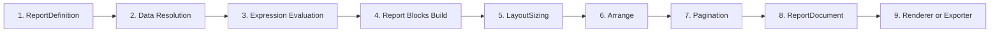

# KineticReports Documentation (Junior Developer Edition)

Welcome. This documentation explains **how KineticReports works end-to-end** and how to extend it safely.

## Start Here

1. [01 - Quick Start for Junior Developers](./01-junior-quick-start.md)
2. [02 - Report Generation Flow](./02-report-generation-flow.md)
3. [03 - Architecture and Project Map](./03-architecture-project-map.md)

## API Reference

4. [04 - Core API Reference (Definition, Layout, Styling, Typography)](./04-api-core-and-definition.md)
5. [05 - Engine and Layout API Reference](./05-api-engine-layout.md)
6. [06 - Rendering, Export, Plugins, and Viewer API Reference](./06-api-rendering-export-viewer.md)

Key clarification:

1. [ReportBlock vs PageSectionBlock (Semantic Distinction)](./04-api-core-and-definition.md#reportblock-vs-pagesectionblock-semantic-distinction)

Fluent builder examples:

1. [Header + Table + Footer code-first fluent example](./04-api-core-and-definition.md#fluent-builder-example)
2. [Short code-first builder example in authoring workflow](./13-report-authoring-and-json-workflow.md#short-code-first-builder-example)
3. [Authoring JSON source-of-truth and serializer flow](./13-report-authoring-and-json-workflow.md#preferred-authoring-json-contract)

## Extension Guides

7. [07 - Extension Points Cheat Sheet](./07-extension-points.md)
8. [08 - Plugin Development Guide (Tutorial + Reference)](./08-plugin-development-guide.md)
9. [09 - Exporter Development Guide (Tutorial + Reference)](./09-exporter-development-guide.md)
10. [10 - Data Provider Development Guide (Tutorial + Reference)](./10-data-provider-development-guide.md)

## Operations

11. [11 - Troubleshooting and Debugging](./11-troubleshooting-and-debugging.md)
12. [12 - Glossary](./12-glossary.md)
13. [13 - Report Authoring, Data Binding, and JSON Workflow](./13-report-authoring-and-json-workflow.md)

## Flow Deep Dives

14. [14 - RunAsync Execution Call Graph](./14-runasync-execution-call-graph.md)
15. [15 - Expression Runtime Flow](./15-expression-runtime-flow.md)
16. [16 - Exporter Execution Flow](./16-exporter-execution-flow.md)

## Architecture Handbook

1. [Visual Document Architecture Handbook](./architecture/visual-document/README.md)

---

## End-to-End Mental Model

**Rule of thumb:**
- Engine builds the report content.
- Layout engine computes placement.
- Renderers/exporters only consume final `ReportDocument`.
